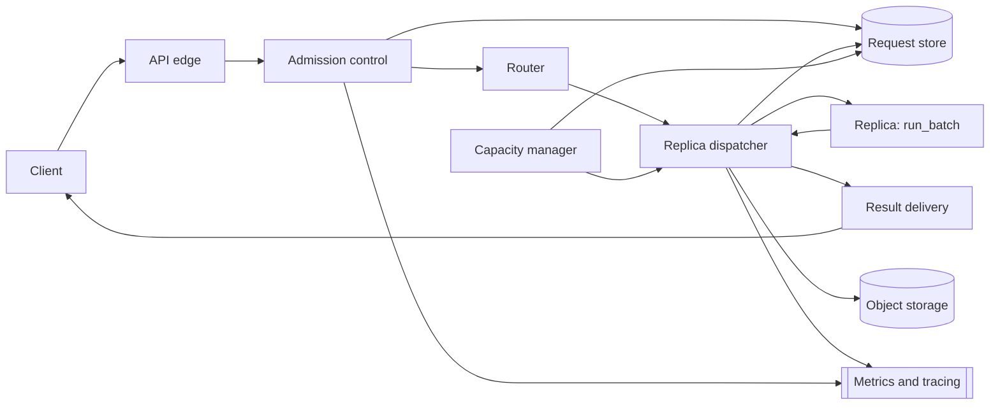

Two points worth confirming before designing: how real-time and offline traffic divide at peak, and whether `run_batch`'s fixed 100 ms cost is independent of `max_output_tokens` or only of how many of the 64 slots are filled. This design assumes an 80/20 split at peak and reads the 100 ms as the cost of one fixed-length decode pass (bounded at 512 tokens): independent of occupancy, since a decode step is bound by reading every weight once from GPU memory rather than by the batch's arithmetic, so an extra request spends spare compute rather than extra wall-clock time until the batch turns compute-bound — but not independent of a generation long enough to need a second call.

### Requirements and scale

**Request rate.** Peak is $10{,}000$ requests/s; the 80/20 split gives $8{,}000$/s real-time and $2{,}000$/s offline.

**Theoretical floor.** Each replica runs one batch at a time — one *slot* per replica ($C = 1$ here; part (e) revisits this when a batch spans more than one GPU). At 100% fill, one replica finishes $64 / 0.1 = 640$ requests/s, so meeting all $10{,}000$/s needs at least

```math
\left\lceil \frac{10{,}000 \times 0.1}{64 \times 1} \right\rceil = \lceil 15.625 \rceil = 16 \text{ replicas.}
```

That floor is not a target to provision at: it leaves almost no spare aggregate capacity ($16$ replicas supply $16 \times 640 = 10{,}240$ requests/s against $10{,}000$/s of demand, and losing even one to a failed health check or a rolling restart drops capacity to $15 \times 640 = 9{,}600$/s, below demand, with queueing delay growing without bound until it returns), and even while every replica stays healthy, running each at $\rho = 625/640 \approx 97.7\%$ utilization (the load $16$ replicas would split evenly) leaves batches almost always full but pushes tail latency up: the discrete-event simulation below measures p99 near 290 ms and a maximum near 390 ms at that utilization, under 500 ms only as long as nothing goes wrong, with none of the slack a burstier-than-Poisson arrival process would need.

**Real-time pool.** Provisioning targets 75% average batch fill per replica (48 of 64 slots), which (a) shows a short `max_wait` achieves once there is any backlog at all. At 75% fill one replica finishes $48 / 0.1 = 480$ requests/s, so the raw requirement is $8{,}000 / 480 \approx 16.7$ replicas; with 20% headroom for rolling deploys and uneven load, $8{,}000 \times 1.2 / 480 = 20$ replicas exactly. At 20 replicas the realized load is $8{,}000 / 20 = 400$/s per replica — $\rho = 62.5\%$ — and the simulation confirms average fill 40/64 (62.5%), p50 wait 150 ms, p95 195 ms, p99 199 ms, maximum about 201 ms: inside the 500 ms SLO even after a further ~25 ms of edge, admission, and network overhead, with about 275 ms of margin for real traffic's extra burstiness.

**Offline pool.** With no per-request latency target, the offline dispatcher sets a long `max_wait` (400 ms here) and lets batches fill by size almost every time, targeting 100% fill: $2{,}000 / 640 = 3.125$ replicas raw, $2{,}000 \times 1.2 / 640 = 3.75$, rounded up to **4 replicas**. At 4 replicas the realized load is $500$/s per replica ($\rho = 78.1\%$); the simulation confirms average fill 64.0/64 ($\approx 100\%$), p50 162 ms, p95 226 ms, p99 243 ms — irrelevant against a minutes-level job SLA.

**Fleet at peak.** $20 + 4 = 24$ replicas (24 GPUs) for this model at its stated traffic share — 50% above the 16-replica theoretical floor, explained by the real-time pool's deliberately lower utilization (protecting tail latency) plus the shared 20% headroom; the offline pool alone is already within one replica of its own floor.

**KV-cache bytes per token.** A representative model configuration: 40 transformer layers, model width $d_{\text{model}} = 5{,}120$, 8 key/value heads with head dimension 128 (grouped-query attention, so $5{,}120 / 128 = 40$ query heads share those 8 KV heads in groups of 5), weights and KV entries stored in bf16 (2 bytes/element). Parameter count from the standard $12 \times n_{\text{layers}} \times d_{\text{model}}^2$ approximation is $12 \times 40 \times 5{,}120^2 \approx 12.6$ billion, so weights occupy about $12.6\text{B} \times 2 \approx 25.2$ GB. A key/value cache entry stores one key and one value vector per layer per KV head:

```math
\text{bytes/token} = 2 \times n_{\text{layers}} \times n_{\text{kv\_heads}} \times \text{head\_dim} \times \text{bytes/elem}
= 2 \times 40 \times 8 \times 128 \times 2 = 163{,}840 \approx 0.164 \text{ MB.}
```

(Full multi-head attention, 40 KV heads instead of 8, would multiply this by 5 to 0.82 MB/token — grouped-query attention is what keeps the cache this small.) On an 80 GB GPU, after 25.2 GB of weights and a 5 GB reserve for activations and runtime overhead, about 49.8 GB remains for KV entries. An average sequence (300 input + 200 output = 500 tokens) needs $500 \times 163{,}840 \approx 81.9$ MB of cache at its full length, so the pool could hold about $49.8\text{ GB} / 81.9\text{ MB} \approx 608$ average-length sequences at once — almost 9.5 times the batch cap of 64, so KV memory does not limit this design's batch size (compute and the fixed-latency contract do); part (c) uses the slack for a prefix cache.

**Queueing-delay budget.** Of the 500 ms real-time SLO, about 25 ms goes to edge/TLS, auth, admission and response transit, leaving about 475 ms for the dispatcher plus the 100 ms execution itself — well over twice the real-time pool's simulated 199 ms p99, the margin this design spends on headroom rather than on maximizing fill.

### Data model and API

**InferenceRequest** — `request_id`, `tenant_id`, `idempotency_key`, `model`, `model_version`, `mode` (`sync | stream | async_batch`), `priority_class` (`realtime | offline`), `prompt_text`, `max_output_tokens`, `status` (`queued | batched | running | succeeded | failed | cancelled`), `cancel_requested`, `replica_id`, `batch_id`, `queued_at`, `dispatched_at`, `completed_at`, `output_text`, `output_tokens`, `failure_reason`.

**Batch** (internal, one row per dispatched `run_batch` call, used for observability and replay) — `batch_id`, `replica_id`, `model_version`, `request_ids` (ordered), `formed_at`, `dispatched_at`, `completed_at`, `fill` (= `len(request_ids)`).

**RateBudget** (per tenant) — `tenant_id`, `tier` (`free | standard | enterprise`), `sustained_qps`, `burst_qps`, `tokens_available`, `last_refill_at`.

Core API:

- `POST /v1/generate` — synchronous. `{model, model_version?, prompt, max_output_tokens, idempotency_key}` → `200 {request_id, output_text, output_tokens}`; a retried call carrying a seen `idempotency_key` returns the stored result instead of running again. `429` (tenant over its rate budget) or `503` (the pool's admitted queue is full) each carry `Retry-After`.
- `POST /v1/generate` with `"mode": "stream"` — opens a Server-Sent Events (SSE) connection: a `queued` event with a queue-position estimate, then either a `result` event carrying the full output once the replica's batch call returns, or an `error` event. This is not token-by-token — see (b).
- `POST /v1/batches` — asynchronous. `{model, model_version, requests: [{prompt, max_output_tokens, idempotency_key}, ...]}` → `202 {batch_job_id, status: "queued", request_count}`; its individual requests are ordinary `InferenceRequest` rows tagged `priority_class = offline`.
- `GET /v1/batches/{batch_job_id}` — `{status, requests_completed, requests_failed, result_uri}`, for polling; `result_uri` is set once every request in the job reaches a terminal status.
- `POST /v1/generate/{request_id}/cancel` — idempotent. A request still waiting in a pending batch is dropped outright; one already claimed by a batch that has been sent to a replica only gets `cancel_requested` set, since a `run_batch` call in flight cannot be partially aborted — the dispatcher discards its output at the next batch boundary instead of returning it. Returns the resulting `status`.
- `GET /v1/generate/{request_id}` — status and, once `succeeded`, the result — for a client that lost its synchronous response or its SSE connection.

### Architecture



A synchronous real-time submission lands at the API edge, which authenticates it and hands it to admission control. A known `(tenant_id, idempotency_key)` returns the stored result at once. Otherwise admission control checks the tenant's rate budget, writes a `queued` `InferenceRequest` row to the store — the one place a request's state is authoritative — and only then acknowledges, so a crash between the two never lets a client believe a request exists that the store has no record of. The router picks a replica in the real-time pool for the request's `(model, model_version)` using the load signal from (b); that replica's dispatcher appends the request to its forming batch and closes it per the size-or-time rule in (a). Once closed, the dispatcher calls `run_batch` and blocks for the fixed 100 ms; on return, it demultiplexes the output list positionally back to each caller, marks every request `succeeded` with its output, and result delivery returns the synchronous HTTP response or emits the SSE `result` event. An offline submission instead arrives through `POST /v1/batches`: admission control fans it into the same per-request store rows, tagged `priority_class = offline`, and routes each one to the offline pool exactly as above except with the dispatcher described in requirements and scale's offline part; finished output goes to object storage, and the batch job's own status rolls up from its requests' statuses rather than being held on a live connection. The capacity manager runs alongside this path, watching each pool's queue depth and per-replica utilization to scale replica counts and reload a cold model onto a freed replica ahead of demand where it can.

### Deep dives

**(a) Batching policy and the achieved-vs-theoretical throughput gap.** A batch's *fill* is the fraction of its `max_batch_size` slots it actually used. The dispatcher runs a *size-or-time* policy: a pending batch closes as soon as it reaches `max_batch_size`, or `max_wait` has elapsed since its first request arrived *and* the replica is free to accept it; if the replica is still busy with a previous batch at that deadline, the pending batch keeps absorbing arrivals rather than closing early, since cutting it sooner would not get it to the replica any faster.

- *Fixed-clock flushing* (flush every `max_wait`, regardless of replica state): rejected. If `max_wait` is shorter than the 100 ms execution time — needed to keep any individual wait short — batches close faster than the replica can drain them, and the ready queue grows without bound at any positive arrival rate; the discrete-event simulation below reproduces this by dropping the replica-aware deferral and sees waits balloon past ten seconds within a five-second burst of arrivals, against sub-second waits for the chosen policy at the same rate.
- *Size-or-time with replica-aware deferral* (chosen): once a replica has any backlog, the timer stops being the binding constraint — the pending batch absorbs arrivals for the whole time the replica is busy, one 100 ms cycle in steady state. That makes achieved fill track utilization directly, $\text{fill} \approx \rho \times 64$, independent of the exact `max_wait` chosen as long as it stays under 100 ms; `max_wait` then only bounds a request's wait when the replica is genuinely idle, the low-utilization case where a short `max_wait` matters least to throughput and most to latency — which is why the real-time pool's 20 ms `max_wait` and the offline pool's 400 ms one need no tuning against each other to produce the fill percentages quoted above.

The queueing cost is bounded and simple: once a replica is saturated enough that the timer rarely binds, a request's wait is at most the running batch's remainder (up to 100 ms) plus its own batch's 100 ms execution — the 150 ms mean and ~200 ms p99 the simulation measures at every tested utilization below about 85%. The *next step* beyond this whole-completion contract is **continuous batching**: instead of one `run_batch` call returning a full completion, each call advances every active sequence by one decode step, so a sequence joins as soon as a slot opens and leaves the instant it stops, rather than waiting for the whole static batch to finish together — removing both costs this design accepts: a short sequence sharing a batch with a long one is held back only by the sequences still running, not the whole batch regenerating from scratch, and a client wanting true token-by-token output no longer needs the chunking workaround in (b).

**(b) Load balancing and admission control.**

*Load-balancing signal.* Uniformly random or round-robin routing ignores that replicas can have different queue depths from bursty arrivals even at equal long-run load, so a request can land on an already-backlogged replica while a quieter one sits underused. *Power of two choices* (chosen): the router samples two replicas at random and sends the request to whichever reports the shorter pending-batch length — avoiding both round robin's blindness to load and the herd effect of always picking the single globally shortest queue under many concurrent routing decisions. Cost: a cheap, close-to-real-time queue-depth read from two replicas per routing decision, rather than zero.

*Rate limits.* Each tenant holds a token bucket per tier — free: 5 requests/s sustained, burst 20; standard and enterprise: higher limits set per contract — refilled continuously and checked at admission. A request that would drain the bucket below zero gets `429` with `Retry-After` computed from the refill rate, not a fixed delay, so a client backs off in proportion to how overdrawn its budget is.

*Bounded queues and load shedding.* Admission control caps the admitted-but-not-yet-completed count per pool at roughly two batch cycles' worth of capacity (for the real-time pool, $20 \times 64 \times 2 = 2{,}560$); past that, new requests are shed — `503` with a short jittered `Retry-After` — starting with the lowest-priority tier, so a burst of free-tier traffic cannot push a paid tenant's requests past the SLO. An *unbounded* queue was rejected: past the cap, added wait buys only a stale answer that still costs a full batch slot once it is finally dispatched.

*Retries and idempotency.* Every request carries a client-chosen `idempotency_key`; the store enforces a uniqueness constraint on `(tenant_id, idempotency_key)` with a several-minute TTL, so a client retrying after a dropped response — not an explicit failure — gets the original result instead of paying for, and being billed for, a second generation.

*Cancellation and timeouts.* A request still forming its batch is simply dropped from the pending list. One already inside a dispatched batch cannot be pulled out mid-call, so cancellation there only sets a flag the dispatcher checks on return, discarding that slot's output instead of returning it — the GPU time is still spent, since `run_batch` has no notion of a partial batch. A request that has waited past a fixed admission timeout (set below the SLO, so the answer would already be late) fails at admission rather than being dispatched at all.

*Streaming against a whole-completion contract.* *Chunked resubmission* — cap `max_output_tokens` low (say 20) and resubmit the growing sequence for its next chunk, forwarding each as it returns — delivers a typewriter effect but pays the fixed 100 ms per chunk, about 10 times the GPU cost of one call for a 200-token response; rejected as a standing policy. *Single-shot over a streaming transport* (chosen): open the SSE connection immediately but deliver the whole result as one `result` event once the single `run_batch` call returns — no incremental text, no extra GPU cost, and for a ~150 ms typical wait the UX cost is small. Genuine token-by-token streaming without the 10x tax needs the continuous-batching contract from (a).

**(c) KV cache and a prefix cache.** Within one sequence, the KV cache holds every previous token's key and value vectors so each new decode step attends over them without recomputing the whole prefix — computation this design's fixed `run_batch` call already accounts for inside its 100 ms cost. *Paged attention* is the standard way to hold that cache in memory: instead of reserving one contiguous, worst-case-length buffer per sequence (wasting memory on padding for every sequence shorter than the pool's longest), the cache is allocated in fixed-size blocks (for example 16 tokens each) from one shared pool per replica, indexed per sequence like a page table. That removes the padding waste and lets a block be reference-counted and shared, copy-on-write, across sequences that share a token prefix — which is what makes a *prefix cache* possible: reusing the KV blocks computed for a prompt prefix common to many requests, skipping that recomputation for every later request that shares it token-for-token from the start.

Whether it pays off is a hit-rate and memory question, not a default. Consider a tenant whose requests share a 150-token system preamble (half the 300-token average input): a resident entry for it costs $150 \times 163{,}840 \approx 24.6$ MB. Reserving 1 GB of the pool's headroom (of the ≈49.8 GB computed above, itself about 9.5 times what the batch cap needs) holds up to $1\text{ GB} / 24.6\text{ MB} \approx 40$ distinct prefixes resident at once — plenty for a handful of hot system prompts, not for arbitrarily many. The hit rate depends on routing: without the prefix-aware signal added to (b), the same prefix is recomputed independently on every replica it lands on, since an entry lives on one replica's GPU memory, not globally. Where requests rarely share a prefix — highly individualized prompts, or a preamble carrying a timestamp ahead of the shared part, defeating a token-for-token match — a prefix cache adds eviction bookkeeping for a hit rate near zero and is not worth adding: a conclusion an estimate should reach, not assume. Eviction, when worth adding: reference-counted LRU over blocks — a block referenced by an in-flight sequence is never evicted; among unreferenced blocks, the least recently used is reclaimed first.

**(d) Isolating real-time from offline traffic.** *A single pool with a priority field on each request* was considered and rejected: an offline request that has already joined a forming batch gives the dispatcher no way to preempt it for an arriving real-time one without violating the same-model-version, one-call-at-a-time contract, so a real-time request could still queue behind an offline-sized batch. *Two separate replica pools* (chosen), each with its own dispatcher parameters — the real-time pool tuned for 75% target fill and a 20 ms `max_wait`, the offline pool for near-100% fill and a 400 ms one — physically prevents that: a real-time request is never routed to a replica an offline batch could occupy. Cost: two pools to capacity-plan and autoscale independently, and a GPU idle in one pool while the other is backlogged cannot be borrowed without reassigning it, a minutes-scale operation.

*SLOs.* Real-time: p95 end-to-end latency ≤ 500 ms, p99 ≤ 900 ms as a secondary target, 99.9% availability. Offline: 95% of submitted jobs complete within 5 minutes of submission at up to 1.5× the provisioned offline throughput; no per-request target.

*Capacity planning and autoscaling.* The 20/4-replica split above is the peak-traffic baseline; the capacity manager scales each pool from queue depth and per-replica utilization, not raw QPS alone, since a shift in average output length changes achieved throughput per replica without changing the request rate. Bringing up a replica — provisioning the instance, pulling the image, loading weights — runs on the order of minutes, so autoscaling cannot be the front line against a sudden spike: bounded admission and per-tier shedding from (b) absorb the burst while new capacity comes up, and a small warm floor of already-loaded, idle replicas per active model means a demand step never waits a full cold load. If a large share of the fleet is lost at once (a zonal failure, a bad rollout), the same admission control tightens first on the free tier, protecting paid real-time SLOs by shedding free-tier requests outright rather than queueing them behind a pool at less than half capacity.

*Observability.* Per pool and per model version: queue depth and admitted-but-undispatched count; batch-fill distribution (to catch a `max_wait` set too short, or a client population not filling batches as assumed); p50/p95/p99 latency split into admission wait, batch-forming wait, and execution; replica utilization and per-replica error rate (to catch a slow or failing replica before load balancing routes around it blindly); `429`/`503` rates by tier; prefix-cache hit rate, if one is running. Every hop should tag logs with `request_id`, so a failed request's trace shows where it spent its time.

**(e) Follow-up: an 8-GPU pool shared by a large and a small model.** Fix a separate pool of 8 GPUs serving two models with equal batch latency: a *small*-model batch needs 1 GPU, a *large*-model batch needs all 8 at once, cannot start with fewer, and cannot share a GPU with anything else while running — a gang-scheduling requirement, not eight independent one-GPU slots.

- *One shared FIFO queue*: rejected. A large request at the head blocks every small request behind it until 8 GPUs happen to be simultaneously free, which under any small-model load can take arbitrarily long — it can starve the whole queue behind it, not just wait its own turn.
- *Two queues, dispatched by comparing instantaneous QPS*: separates batch formation for the two models, but "whichever has higher QPS" is not a rule for the moment a large batch and free capacity coexist, and does nothing to stop a steady trickle of small requests from keeping a few GPUs busy just often enough that all 8 are never simultaneously free.
- *Aging-triggered atomic reservation with a bounded drain* (chosen): small batches dispatch onto any free GPU immediately, up to all 8. A large batch, once formed, starts a clock; once it has waited `aging` with the pool not entirely free, the dispatcher stops admitting *new* small batches — batches already running finish normally — and launches the large batch the instant all 8 are free at once. This bounds the large model's wait to `aging` plus one more small-batch execution (100 ms), and a small request's wait to one large run (100 ms) plus draining whatever was already queued ahead of it; the simulation below runs both queues to completion, at these arrival rates, and confirms neither grows without bound.

The *utilisation cost* splits into two, only one of them this policy's fault. Reserving all 8 GPUs for the full 100 ms on every large dispatch, regardless of its own fill, is inherent to gang-scheduling the whole pool, not a scheduling inefficiency. What the policy spends on top is the *drain* itself: a GPU that finishes its small batch during a drain sits idle rather than starting new work, waiting for the slowest still-running small batch before the pool can hand all 8 to the large batch at once. At `aging` = 100 ms that idle-during-drain cost is about 8.4% of GPU-seconds; raising `aging` to 300 ms cuts it to about 6.4% — fewer, fuller drains — at the cost of roughly a quarter more p99 wait for both models. The knob trades tail latency for utilization, not one model's latency for the other's, and neither setting drives idle time to zero, which would need knowing in advance which running small batch finishes last.

### Follow-ups

- Bringing up a new GPU replica faster: keep a small warm floor of already-loaded replicas per active model (from (d)) rather than scaling strictly from zero; serve weights from a fast local or co-located cache instead of pulling from cold object storage on every boot; and stagger a large batch of new replicas' health-check registration so they do not all announce readiness — and all get routed to — in the same instant.
- Prefill (encoding the prompt) and decode (generating tokens one at a time) have different compute/memory profiles once the design moves to continuous batching; production systems often run them as separate replica pools so a long prompt's prefill burst does not stall in-flight decode steps for other sequences on the same GPU.
- An `idempotency_key` collision from two genuinely different requests (a client bug, not a retry) is indistinguishable at the store from a legitimate retry; hashing the request body into the stored record and returning `409` on a key reused with different content catches it.
- Cold-start for an inactive model competes with the warm floor for GPUs; the capacity manager should weigh a model's recent request rate against how many replicas reloading it would take from other models before evicting one.

```python
import heapq
import math
import random
import statistics as stats

B_MAX, T_BATCH = 64, 0.1

# ---- request rate and theoretical floor ----
qps_peak = 10_000
qps_rt, qps_offline = 8_000, 2_000
assert qps_rt + qps_offline == qps_peak

theoretical_floor = math.ceil(qps_peak * T_BATCH / B_MAX)
assert theoretical_floor == 16
assert 16 * (B_MAX / T_BATCH) == 10_240 > qps_peak            # spare aggregate capacity, healthy
assert 15 * (B_MAX / T_BATCH) == 9_600 < qps_peak              # one replica down: capacity < demand

# ---- real-time pool ----
target_fill_rt = 0.75
throughput_per_replica_rt = target_fill_rt * B_MAX / T_BATCH   # 480/s
raw_rt = qps_rt / throughput_per_replica_rt
assert round(raw_rt, 1) == 16.7
n_rt = math.ceil(raw_rt * 1.2)
assert n_rt == 20
realized_rate_rt = qps_rt / n_rt
assert realized_rate_rt == 400.0
assert round(realized_rate_rt * T_BATCH / B_MAX, 3) == 0.625    # realized utilization

# ---- offline pool ----
target_fill_offline = 1.0
throughput_per_replica_offline = target_fill_offline * B_MAX / T_BATCH   # 640/s
raw_offline = qps_offline / throughput_per_replica_offline
assert round(raw_offline, 3) == 3.125
n_offline = math.ceil(raw_offline * 1.2)
assert n_offline == 4
realized_rate_offline = qps_offline / n_offline
assert realized_rate_offline == 500.0
assert round(realized_rate_offline * T_BATCH / B_MAX, 5) == 0.78125

fleet = n_rt + n_offline
assert fleet == 24
assert round(fleet / theoretical_floor, 2) == 1.5

# ---- KV-cache bytes per token, from a stated model configuration ----
n_layers, d_model, n_kv_heads, head_dim, bytes_per_elem = 40, 5_120, 8, 128, 2
n_query_heads = d_model // head_dim
assert n_query_heads == 40 and n_query_heads // n_kv_heads == 5

params = 12 * n_layers * d_model ** 2
assert params == 12_582_912_000
weight_gb = params * bytes_per_elem / 1e9
assert round(weight_gb, 1) == 25.2

kv_bytes_per_token = 2 * n_layers * n_kv_heads * head_dim * bytes_per_elem
assert kv_bytes_per_token == 163_840
assert round(kv_bytes_per_token / 1e6, 3) == 0.164

kv_bytes_per_token_mha = 2 * n_layers * n_query_heads * head_dim * bytes_per_elem
assert kv_bytes_per_token_mha == 5 * kv_bytes_per_token          # GQA group size, confirmed

gpu_mem_gb, reserve_gb = 80, 5
available_gb = gpu_mem_gb - weight_gb - reserve_gb
assert round(available_gb, 1) == 49.8

avg_input, avg_output = 300, 200
seq_len = avg_input + avg_output
kv_per_seq_mb = seq_len * kv_bytes_per_token / 1e6
assert round(kv_per_seq_mb, 1) == 81.9

max_concurrent = available_gb * 1e9 / (kv_per_seq_mb * 1e6)
assert int(max_concurrent) == 608
assert round(max_concurrent / B_MAX, 1) == 9.5

# prefix cache: a 150-token shared prefix
prefix_len = 150
prefix_mb = prefix_len * kv_bytes_per_token / 1e6
assert round(prefix_mb, 1) == 24.6
n_prefixes_per_gb = int(1e9 // (prefix_mb * 1e6))
assert n_prefixes_per_gb == 40

print("all requirements-and-scale numbers check out")

# ---- discrete-event simulation of one replica's size-or-time batcher ----
def simulate_replica(rate, max_batch, max_wait, batch_time, duration, seed, warmup=5.0,
                      replica_aware=True):
    rng = random.Random(seed)
    arrivals, t = [], 0.0
    while t < duration:
        t += rng.expovariate(rate)
        if t < duration:
            arrivals.append(t)
    finish = [None] * len(arrivals)
    by_time = {}
    for i, at in enumerate(arrivals):
        by_time.setdefault(at, []).append(i)

    events, seq = [], 0
    def push(time, kind, data=None):
        nonlocal seq
        heapq.heappush(events, (time, seq, kind, data)); seq += 1
    for i, at in enumerate(arrivals):
        push(at, "ARRIVE", i)

    pending, gen, expired, ready, busy = [], 0, False, [], False
    fills = []

    def close():
        nonlocal pending, gen, expired
        ready.append(list(pending)); pending = []; gen += 1; expired = False

    def dispatch(now):
        nonlocal busy
        if not busy and ready:
            batch = ready.pop(0); busy = True; fills.append(len(batch))
            push(now + batch_time, "FREE", batch)

    # a hard cap on processed events keeps a pathologically unstable configuration (the rejected
    # fixed-clock policy below) from running away instead of finishing quickly with huge waits
    processed = 0
    while events and processed < 4_000_000:
        now, _, kind, data = heapq.heappop(events)
        processed += 1
        if kind == "ARRIVE":
            at = arrivals[data]
            if not pending:
                push(at + max_wait, "TIMER", gen)
            pending.append(at)
            if len(pending) >= max_batch:
                close(); dispatch(now)
        elif kind == "TIMER":
            if pending and data == gen:
                if not busy or not replica_aware:
                    close(); dispatch(now)
                else:
                    expired = True
        elif kind == "FREE":
            for at in data:
                for i in by_time[at]:
                    if finish[i] is None:
                        finish[i] = now; break
            busy = False
            if ready:
                dispatch(now)
            elif pending and expired:
                close(); dispatch(now)

    waits = [f - a for a, f in zip(arrivals, finish) if f is not None and a >= warmup]
    return dict(
        fill_pct=stats.mean(fills) / max_batch * 100 if fills else 0.0,
        n_completed=sum(1 for f in finish if f is not None), n_total=len(arrivals),
        p50=stats.median(waits), p95=stats.quantiles(waits, n=100)[94],
        p99=stats.quantiles(waits, n=100)[98], max=max(waits),
    )

# rejected alternative: fixed-clock flushing (max_wait shorter than the 100 ms execution time,
# ignoring replica state) is unstable -- waits grow without bound instead of settling
unstable = simulate_replica(rate=400.0, max_batch=B_MAX, max_wait=0.02, batch_time=T_BATCH,
                             duration=5.0, seed=1, warmup=0.0, replica_aware=False)
assert unstable["max"] > 10                                     # seconds, not milliseconds --
                                                                  # and still growing when arrivals stop

# chosen policy: fill tracks utilization once max_wait is kept under the 100 ms execution time
floor_risk = simulate_replica(rate=625.0, max_batch=B_MAX, max_wait=0.02, batch_time=T_BATCH,
                               duration=400, seed=5)
assert 96 < floor_risk["fill_pct"] < 99
assert 250 < floor_risk["p99"] * 1000 < 340
assert 350 < floor_risk["max"] * 1000 < 450

real_time = simulate_replica(rate=realized_rate_rt, max_batch=B_MAX, max_wait=0.02,
                              batch_time=T_BATCH, duration=400, seed=42)
assert real_time["n_completed"] == real_time["n_total"]
assert 61 < real_time["fill_pct"] < 64
assert 140 < real_time["p50"] * 1000 < 160
assert 190 < real_time["p99"] * 1000 < 210
assert real_time["max"] * 1000 < 500                            # SLO's batching-layer budget

offline = simulate_replica(rate=realized_rate_offline, max_batch=B_MAX, max_wait=0.4,
                            batch_time=T_BATCH, duration=400, seed=11)
assert offline["n_completed"] == offline["n_total"]
assert offline["fill_pct"] > 99.5
assert offline["p99"] * 1000 < 300

print("batching-policy simulation confirms the max-wait / fill / latency claims")

# ---- discrete-event simulation of the 8-GPU heterogeneous pool ----
class HeterogeneousPool:
    def __init__(self, rate_small, rate_large, batch_small, batch_large, w_small, w_large,
                 batch_time, n_gpus, aging, duration, seed):
        rng = random.Random(seed)
        def poisson(rate):
            out, t = [], 0.0
            while t < duration:
                t += rng.expovariate(rate)
                if t < duration:
                    out.append(t)
            return out
        self.arr_s, self.arr_l = poisson(rate_small), poisson(rate_large)
        self.fin_s = [None] * len(self.arr_s)
        self.fin_l = [None] * len(self.arr_l)
        self.by_s, self.by_l = {}, {}
        for i, at in enumerate(self.arr_s):
            self.by_s.setdefault(at, []).append(i)
        for i, at in enumerate(self.arr_l):
            self.by_l.setdefault(at, []).append(i)
        self.batch_small, self.batch_large = batch_small, batch_large
        self.w_small, self.w_large, self.t = w_small, w_large, batch_time
        self.n_gpus, self.aging, self.duration = n_gpus, aging, duration
        self.events, self.seq = [], 0
        for i, at in enumerate(self.arr_s):
            self._push(at, "ARR_S", i)
        for i, at in enumerate(self.arr_l):
            self._push(at, "ARR_L", i)
        self.pend_s, self.gen_s, self.expired_s, self.ready_s = [], 0, False, []
        self.free = n_gpus
        self.pend_l, self.gen_l, self.ready_l = [], 0, []   # ready_l: list of (ready_at, batch)
        self.mode = "normal"          # normal | draining | running_large
        self.fills_s, self.fills_l = [], []
        self.drain_idle_seconds = 0.0
        self._d_t = self._d_free = None

    def _push(self, t, kind, data=None):
        heapq.heappush(self.events, (t, self.seq, kind, data)); self.seq += 1

    def _close_s(self):
        self.ready_s.append(list(self.pend_s)); self.pend_s = []
        self.gen_s += 1; self.expired_s = False

    def _close_l(self, now):
        self.ready_l.append((now, list(self.pend_l))); self.pend_l = []; self.gen_l += 1

    def _dispatch_s(self, now):
        while self.mode == "normal" and self.free > 0 and self.ready_s:
            batch = self.ready_s.pop(0); self.free -= 1; self.fills_s.append(len(batch))
            self._push(now + self.t, "FREE_S", batch)

    def _track_drain_idle(self, now):
        if self._d_t is not None:
            self.drain_idle_seconds += self._d_free * (now - self._d_t)
        self._d_t, self._d_free = now, self.free

    def _evaluate_large(self, now):
        if self.mode == "draining":
            self._track_drain_idle(now)
            if self.free == self.n_gpus:
                _, batch = self.ready_l.pop(0); self.fills_l.append(len(batch))
                self.mode = "running_large"; self._d_t = None
                self._push(now + self.t, "FREE_L", batch)
            return
        if self.mode != "normal" or not self.ready_l:
            return
        ready_at, _ = self.ready_l[0]
        if self.free == self.n_gpus:
            _, batch = self.ready_l.pop(0); self.fills_l.append(len(batch))
            self.mode = "running_large"
            self._push(now + self.t, "FREE_L", batch)
        elif now - ready_at >= self.aging:
            self.mode = "draining"; self._d_t, self._d_free = now, self.free

    def run(self):
        while self.events:
            now, _, kind, data = heapq.heappop(self.events)
            if kind == "ARR_S":
                at = self.arr_s[data]
                if not self.pend_s:
                    self._push(at + self.w_small, "TIMER_S", self.gen_s)
                self.pend_s.append(at)
                if len(self.pend_s) >= self.batch_small:
                    self._close_s(); self._dispatch_s(now)
            elif kind == "TIMER_S":
                if self.pend_s and data == self.gen_s:
                    if self.mode == "normal" and self.free > 0:
                        self._close_s(); self._dispatch_s(now)
                    else:
                        self.expired_s = True
            elif kind == "ARR_L":
                at = self.arr_l[data]
                if not self.pend_l:
                    self._push(at + self.w_large, "TIMER_L", self.gen_l)
                self.pend_l.append(at)
                if len(self.pend_l) >= self.batch_large:
                    self._close_l(now); self._evaluate_large(now)
            elif kind == "TIMER_L":
                if self.pend_l and data == self.gen_l:
                    self._close_l(now); self._evaluate_large(now)
            elif kind == "FREE_S":
                for at in data:
                    for i in self.by_s[at]:
                        if self.fin_s[i] is None:
                            self.fin_s[i] = now; break
                self.free += 1
                self._evaluate_large(now)
                if self.mode == "normal":
                    if self.pend_s and self.expired_s and self.free > 0:
                        self._close_s()
                    self._dispatch_s(now)
            elif kind == "FREE_L":
                for at in data:
                    for i in self.by_l[at]:
                        if self.fin_l[i] is None:
                            self.fin_l[i] = now; break
                self.free = self.n_gpus
                self.mode = "normal"
                self._evaluate_large(now)
                if self.mode == "normal":
                    if self.pend_s and self.expired_s and self.free > 0:
                        self._close_s()
                    self._dispatch_s(now)
        return self

    def stats(self, warmup=5.0):
        def waits(arr, fin):
            return [f - a for a, f in zip(arr, fin) if f is not None and a >= warmup]
        w_s, w_l = waits(self.arr_s, self.fin_s), waits(self.arr_l, self.fin_l)
        gpu_seconds = self.n_gpus * (self.duration - warmup)
        small_gpu_s = len(self.fills_s) * self.t
        large_gpu_s = len(self.fills_l) * self.t * self.n_gpus
        return dict(
            n_s=len(self.arr_s), n_l=len(self.arr_l),
            done_s=sum(1 for f in self.fin_s if f is not None),
            done_l=sum(1 for f in self.fin_l if f is not None),
            fill_s=stats.mean(self.fills_s) / self.batch_small * 100,
            fill_l=stats.mean(self.fills_l) / self.batch_large * 100,
            p99_s=stats.quantiles(w_s, n=100)[98], max_s=max(w_s),
            p99_l=stats.quantiles(w_l, n=100)[98], max_l=max(w_l),
            small_gpu_pct=100 * small_gpu_s / gpu_seconds,
            large_gpu_pct=100 * large_gpu_s / gpu_seconds,
            idle_drain_pct=100 * self.drain_idle_seconds / gpu_seconds,
        )

common = dict(rate_small=1000, rate_large=8, batch_small=32, batch_large=8,
              w_small=0.015, w_large=0.150, batch_time=T_BATCH, n_gpus=8, duration=300, seed=7)

het_100 = HeterogeneousPool(aging=0.100, **common).run().stats()
het_300 = HeterogeneousPool(aging=0.300, **common).run().stats()

for r in (het_100, het_300):
    assert r["done_s"] == r["n_s"] and r["done_l"] == r["n_l"]   # every request finishes: no starvation
    assert r["max_s"] < 1.0 and r["max_l"] < 1.0                  # both bounded well under a second
    assert r["p99_l"] / r["p99_s"] < 2 and r["p99_s"] / r["p99_l"] < 2   # neither class's tail dwarfs the other's

assert 75 < het_100["fill_s"] < 82 and 24 < het_100["fill_l"] < 30
assert 460 < het_100["p99_s"] * 1000 < 500 and 480 < het_100["p99_l"] * 1000 < 510
assert 7 < het_100["idle_drain_pct"] < 10

assert 590 < het_300["p99_s"] * 1000 < 620 and 670 < het_300["p99_l"] * 1000 < 700
assert 5 < het_300["idle_drain_pct"] < 8
assert het_300["idle_drain_pct"] < het_100["idle_drain_pct"]      # longer aging: fewer, fuller drains
assert het_300["p99_s"] > het_100["p99_s"] and het_300["p99_l"] > het_100["p99_l"]  # ... at a latency cost
assert abs(het_300["large_gpu_pct"] - het_100["large_gpu_pct"]) < 0.1   # reservation cost is aging-independent

print("8-GPU heterogeneous-pool simulation confirms neither model starves")
print("all estimation numbers check out")
```
