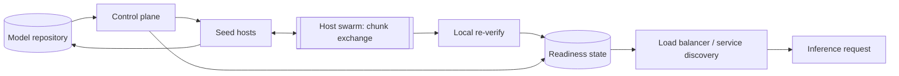

Worth confirming before designing: which link variant is in play — this design treats full-duplex as the default and re-derives the shared case wherever the answer changes — and whether the object store's own throughput to many simultaneous readers could itself be a limit distinct from the repository's stated 10 Gbps egress (assumed here not to be; 10 Gbps is the binding constraint on the repository side).

### Requirements and scale

**Setup.** $S = 500$ GB $= 500 \times 10^9$ bytes ($200$ shard files of $2.5 \times 10^9$ bytes each). A 10 Gbps link moves $B = 10 \times 10^9 / 8 = 1.25 \times 10^9$ bytes/s. Moving one checkpoint's worth of bytes over one such link therefore takes

$$
S / B = 500 \times 10^9 / 1.25 \times 10^9 = 400 \text{ s.}
$$

**Lower bound, full-duplex.** Two independent arguments both land on $S/B$. First, every host must receive all $S$ bytes and its download rate is capped at $B$ even if the rest of the network is idle, so no host finishes before $400$ s. Second, at $t=0$ only the repository holds the checkpoint; pushing even one full copy onto the network takes the repository $S/B$ seconds at its own capped rate $B$, so nothing — not even a single, best-placed recipient — can be fully served earlier than $t = 400$ s either. Neither argument depends on $N$: more hosts cannot lower the bound, and, as the chunked design below shows, need not raise it by much.

**Lower bound, shared link.** Under a shared link, a host that spends part of its budget uploading to peers has that much less left for its own download: if host $i$ downloads $d_i$ bytes and uploads $u_i$ bytes over a rollout of length $T$, then $d_i + u_i \le BT$. Every host must fully receive the checkpoint, so in the best case $d_i = S$ (no host ever receives a redundant byte) and therefore $u_i \le BT - S$. Every byte any host receives was sent by exactly one sender — the repository or another host — so total bytes sent must cover the $NS$ bytes of demand:

$$
NS \;\le\; \underbrace{BT}_{\text{repository}} \;+\; \underbrace{N(BT - S)}_{\text{hosts' uploads}}
\quad\Longrightarrow\quad
T \;\ge\; \frac{2NS}{B(N+1)}.
$$

(The repository never downloads, so its full $B$ is available for sending under either link variant.) As $N \to \infty$ this tends to $2S/B$: on a shared link, every byte a host relays costs it twice — once to receive it, once to resend it — out of the same budget, so a fully peer-assisted design can at best roughly double, not match, the full-duplex bound. For $N=100$: $T \ge 2 \times 100 \times 400/101 \approx 792$ s. For $N=1{,}000$: $T \ge 2 \times 1{,}000 \times 400/1{,}001 \approx 799$ s — both already within a percent of the asymptote.

**Naive: every host pulls from the repository.** With no forwarding at all, the repository is the only sender and must push $N$ full copies through its one capped link — whether it serves hosts one after another at full rate or all $N$ at once by splitting its bandwidth $N$ ways, the total bytes it must push is the same, $NS$:

$$
T_{\text{naive}} = N \cdot S / B.
$$

$N=100$: $100 \times 400 = 40{,}000$ s ($\approx 11.1$ hours). $N=1{,}000$: $1{,}000 \times 400 = 400{,}000$ s ($\approx 4.6$ days) — unworkable at either scale, and worsening in direct proportion to fleet size.

**Tree broadcast, store-and-forward.** Arrange the $N$ hosts as a complete $k$-ary tree rooted at the repository: the repository serves $k$ first-level hosts, each of those serves $k$ of its own, and so on. A host cannot forward what it does not yet have, so under *store-and-forward* — wait for the whole file, then relay it — a host starts serving its own $k$ children only once it holds the complete checkpoint, $S/B$ seconds after its parent started serving it. Serving $k$ children — in turn at full rate, or all at once at rate $B/k$ each — moves $k$ files' worth of bytes out of one capped link either way, taking $k \cdot S/B$; each additional level adds that much to the completion time. With depth $D$ (the smallest $D$ with $k + k^2 + \dots + k^D \ge N$, the point by which every host is placed):

$$
T_{\text{tree,SAF}} = D \cdot k \cdot S/B.
$$

Approximating $D \approx \ln N / \ln k$, minimizing $D \cdot k$ over $k$ means minimizing $k/\ln k$, whose derivative $(\ln k - 1)/(\ln k)^2$ is zero at $k = e \approx 2.718$ — branching factors of 2 and 3 are both close to optimal, and for the sizes here they tie exactly. At $k=2$: $N=100$ needs $D=6$ ($2+4+\dots+64 = 126 \ge 100$, while five levels sum to only 62), so $T = 6 \times 2 \times 400 = 4{,}800$ s ($80$ min). $N=1{,}000$ needs $D=9$ ($1{,}022 \ge 1{,}000$ across nine levels), so $T = 9 \times 2 \times 400 = 7{,}200$ s ($2$ h). Far better than naive, but every level still pays a full $S/B$ per child served, and a larger fleet keeps adding levels.

**Tree broadcast, pipelined.** Splitting the checkpoint into $C = S/c$ chunks of size $c$ and forwarding each the instant it arrives removes the "wait for the whole file" cost: a chunk now takes only $c/B$ to move one hop, so the first chunk reaches depth $D$ in about $D \cdot c/B$ instead of $D \cdot S/B$. What pipelining does not remove is the $k$-way split: a node's one upload link is still divided, in some rotation, across its $k$ children, so any one child receives new chunks only a $1/k$ share of the time — an effective download rate of $B/k$, giving that child $S/(B/k) = k \cdot S/B$ once its parent starts feeding it. With $c$ small next to $S$ the one-time depth term is negligible, so

$$
T_{\text{tree,pipelined}} \approx k \cdot S/B,
$$

independent of $N$ — pipelining shrinks away the part of the cost that depended on depth. At $k=2$ this is $800$ s regardless of fleet size: a large improvement on the store-and-forward tree and no longer growing with $N$, but still twice the $400$ s bound, since every host remains limited to one parent's bandwidth share.

**Chunked pipelined chain.** Shrinking the fan-out to $k=1$ — a strict chain, repository $\to$ host$_1 \to$ host$_2 \to \cdots \to$ host$_N$, each forwarding only to the next — removes the split too: a host's upload link now serves exactly one downstream host, at the full rate $B$. With chunk transfer time $t_c = c/B$, the repository emits chunk $i$ at $(i-1)t_c$, and each hop adds one more $t_c$ of delay, so chunk $i$ reaches the $j$-th host in the chain at $(i+j-1)t_c$. The last chunk ($i=C$) reaching the last host ($j=N$) sets the completion time:

$$
T_{\text{chain}} = (C + N - 1) \cdot t_c = \underbrace{C \cdot t_c}_{=\,S/B} + (N-1)\cdot c/B.
$$

At $c = 50$ MB ($C = 10{,}000$ chunks, $t_c = 40$ ms): $N=100$ gives $400 + 99 \times 0.04 = 403.96$ s — one percent over the bound. $N=1{,}000$ gives $400 + 999 \times 0.04 = 439.96$ s — about ten percent over, and shrinking further with smaller chunks. This already beats every tree variant above at either scale, but a chain is a single dependency line: one slow or dead host stalls everyone behind it.

**Chunked peer-to-peer swarm.** Letting every host that holds a chunk offer it to *any* host that lacks it, not just a fixed successor, keeps the chain's "no split, full-rate hop" property — a receiver can pull different chunks from different senders, each at up to $B$, rather than depending on one parent's full cooperation — while removing the single dependency line: once enough hosts hold enough distinct chunks, a host sources its remaining chunks from several peers at once and its own download saturates at $B$, so completion time approaches the same $S/B$ plus a small ramp-up term, no longer tied to any one host's health. This is the design carried through the rest of this page; the simulation in the estimate check below measures how close a simple, deterministic version of it gets. Under a shared link the swarm cannot beat the $\approx 2S/B$ bound derived above — every peer must still split one budget between its own download and what it forwards — but the same chunk-exchange mechanism still applies, and how a host splits its budget between the two is a scheduling choice, taken up in deep dive (c).

```text
                                   N = 100   N = 1,000
naive (pull from repository)        11.1 h       4.6 d
tree, store-and-forward             80 min         2 h
tree, pipelined (k = 2)              800 s       800 s
chunked chain                     403.96 s    439.96 s
lower bound, full duplex             400 s       400 s
lower bound, shared link             792 s       799 s
```

### Data model and API

**Manifest** (one per published version) — `version_id`, `created_at`, `status` (`publishing | active | deprecated`), `total_bytes`, `chunk_size`, `shards`: ordered list of `{shard_id, path, size_bytes}`, `chunks`: ordered list of `{chunk_id, shard_id, offset, length, sha256}`, `manifest_sha256` (the hash of the ordered list of chunk hashes — the one value a host checks before it trusts anything else in a manifest it just fetched).

**HostState** (one row per `(host_id, version_id)` in flight or completed) — `host_id`, `version_id`, `chunks_have` (a bitmap of length $C$), `status` (`fetching | verifying | ready | failed`), `verified_at`, `activated_at`, `last_progress_at` (the last time `chunks_have` changed, used in deep dive (c)).

**PeerSample** (ephemeral — gossiped between hosts rather than kept durably, see deep dive (b)) — `host_id`, `version_id`, `chunks_have`, `as_of`.

Control-plane API:

- `POST /versions` — `{shards: [{path, size_bytes}, ...], chunk_size}`: the control plane hashes every chunk directly against the repository copy, builds the `Manifest`, and returns `{version_id, manifest_sha256, chunk_count}` with `status: "publishing"`.
- `GET /versions/{version_id}/manifest` — the full manifest; every host fetches this once, before requesting any chunk.
- `POST /versions/{version_id}/activate` — flips `status` to `active` once enough of the fleet is `ready` (deep dive (a)); at most one version is `active` at a time.
- `GET /versions/{version_id}/rollout` — per-host `status` and `last_progress_at`, for the observability view in deep dive (c).

Host-facing API:

- `POST /hosts/{host_id}/versions/{version_id}/chunks/{chunk_id}` — a host reports a chunk received and its own hash of it; a mismatch leaves that bit unset in `chunks_have` (deep dive (b) covers what the host does next) and increments a per-chunk corruption counter used to stop sampling a consistently bad sender.
- `GET /hosts/{host_id}/versions/{version_id}/peers` — a bounded, rarest-chunk-biased sample of other hosts' `chunks_have` bitmaps for this version, used to pick who to pull the next chunk from (deep dive (b)).
- `POST /hosts/{host_id}/versions/{version_id}/ready` — sent once `chunks_have` is full and every chunk has been independently re-verified against the manifest hash; moves `HostState.status` to `ready`.
- `GET /versions/active` — the read a load balancer or service discovery makes before routing any request: the currently `active` `version_id`, and, scoped to it, which `host_id`s are `ready` (deep dive (a)).

### Architecture



A rollout starts when a new checkpoint's shard files land in the repository and `POST /versions` is called; the control plane hashes every chunk once from the repository copy, publishes the `Manifest`, and points a small number of *seed* hosts at the repository directly — enough that the repository's own $B$-byte/s link is fully used without being asked to serve the whole fleet, sized quantitatively in deep dive (c). Every host, seed or not, fetches the manifest once, then repeatedly asks a sample of peers for their `chunks_have` bitmaps and pulls the rarest chunk it is missing from whichever sampled peer has it (deep dive (b)); as soon as a host holds a chunk and has checked it against the manifest hash, it starts offering that chunk to its own sampled peers, so the fleet's aggregate serving capacity grows from "just the seeds" to "nearly every host" within the first few chunk exchanges. A host moves to `verifying` once `chunks_have` is full, re-hashes every chunk once more against local disk — this catches corruption introduced after the network transfer, not only during it — and calls `ready` only once every chunk passes; nothing before that point is reachable through `GET /versions/active`. Once enough hosts are `ready`, the control plane flips the version to `active`, and the load balancer's next read of `GET /versions/active` starts routing to those hosts for that version; a host still serving an older version keeps doing so, unaffected, until it independently reaches `ready` on the new one and the same read starts including it.

### Deep dives

**(a) Integrity, versioning and the atomic switch.** A chunk's correctness is checked twice: once by the receiving host right after the transfer, so a bad chunk is re-fetched from a different peer within one round trip (deep dive (b)), and once more, against the same manifest hash, once every chunk is in place and the host is about to call `ready` — catching corruption from local disk, a bit-flip during assembly, or a chunk that verified correctly on arrival but was since overwritten. The manifest's own `manifest_sha256` is checked before either: a host that fetched a corrupted manifest must not trust any individual chunk hash it contains.

A host's readiness for a version is the one signal `GET /versions/active` exposes, and it is what keeps the switch atomic. Two ways to define "switched":

- *Switch as soon as the control plane marks the version active*: rejected. A host can be marked active before its inference process has finished loading the new weights into GPU memory (out of scope here, but not instantaneous), so a request could land on a host answering with stale, half-loaded, or no weights at all.
- *Switch per host, gated on that host's own readiness* (chosen): the control plane's `active` flag only names the fleet's *target* version; the load balancer's actual routing set is the separately tracked set of hosts that reached `ready` and finished loading. A host is either fully on the new version and reachable, or still on its last fully-loaded version and reachable under that one — never both, never neither. Cost: two versions' weights briefly coexist on disk, and in the routing set, rather than a single fleet-wide cutover instant; the older version's local copy is reclaimed only once every host has moved off it, which also gives an instant rollback path if the new version's health checks regress after activation — stop advancing `active` and let hosts already on the old version keep serving it, with nothing to re-download.

**(b) Failure handling: stragglers, dead peers, and recovery without a coordinator.** A *straggler* is a host still making progress but well behind the rest of the fleet. Three situations, distinguished by what a receiving host observes about the peer it is currently pulling from:

- *A single chunk transfer fails or times out*, the sending peer otherwise fine: the receiver simply asks a different peer, or the repository, for the same chunk. Nothing durable changes — that chunk's bit in `chunks_have` was just never set.
- *A peer stops answering entirely* — dead, or partitioned. A central coordinator assigning chunks to sources could notice this from missed heartbeats and reassign; without one, every host already re-samples peers and re-picks a source for each of its own outstanding chunks on a short interval, so a dead peer is simply dropped from circulation the next time anyone samples it — it stops appearing as an option, and any transfer already in flight from it times out like the single-chunk case above. No separate failure-detection step is needed beyond the retry path every host already runs, and re-sourcing a chunk this way never has to mean falling back to the repository specifically: by the time a peer dies mid-rollout the chunk it held is typically already on several other hosts too.
- *A peer is slow rather than dead* — still answering, just under line rate. Since every host pulls the rarest chunk it lacks from whichever sampled peer offers it, a slow peer simply gets asked less: faster peers end up supplying more of any given rare chunk before the slow one's transfer even completes, so a straggler degrades its own contribution rather than blocking anyone waiting specifically on it — the dependency a chain has on each individual link, which the swarm's multi-source pulls are built to avoid.

*Rarest-first* selection is what makes this converge instead of stalling: always pulling the globally least-replicated chunk keeps every chunk's replica count roughly even across the fleet, so a peer dying never leaves a chunk orphaned — held by so few survivors that finishing the fleet hinges on reaching exactly them — because no chunk was ever allowed to fall far behind the others in how widely it had spread. A fleet-wide loss of the *only* remaining copy of a chunk (every holder dies at once) is the one case peer redundancy alone cannot fix; the repository keeps the original shard files for the lifetime of the version specifically as that fallback, and answers a request for the missing chunk like any other peer would.

A host that dies mid-rollout and restarts resumes from its last persisted `chunks_have` instead of starting over — chunk-level progress is checkpointed to local disk as each chunk is verified, so a restart re-verifies what is already on disk (cheap: hashing, not re-downloading) and only re-requests what was missing. A host that is replaced outright joins as a fresh participant with an empty `chunks_have`, indistinguishable from a slow-starting new host, and catches up the same way.

**(c) Rate limiting against serving traffic, and observability.** Every host here is typically already running inference on its current version while it downloads the next one: the same NIC carries both the checkpoint chunks and the requests and responses of live traffic, and an unthrottled swarm participant will use its full $B$ for chunk exchange the instant it has data to move, starving whatever inference bandwidth needs at that moment. Distribution traffic is therefore throttled at each host to a configured ceiling well under $B$ — a token bucket on the chunk-fetch and chunk-serve paths specifically, drawn from a budget separate from whatever inference traffic uses, rather than left to contend for the link uncontrolled. The ceiling trades rollout speed for a bound on how much bandwidth distribution can ever take from serving; a host not yet serving any traffic on its current version (freshly booted, still loading) has nothing to protect yet and can run distribution at a higher ceiling, which is also why the seed hosts chosen to pull from the repository first are drawn from spare or draining capacity where possible.

Because every host reports `chunks_have` progress and a `status`, a rollout's shape is visible without guessing at per-host capacity: the rollout view (`GET /versions/{version_id}/rollout`) buckets hosts by status and, within `fetching`, by time since `last_progress_at` — a host whose bitmap has not grown in several multiples of the expected per-chunk time is flagged as *stuck* rather than merely slow, distinguishing "still working, behind schedule" from "not progressing at all" without needing that host's achieved throughput known ahead of time. A rollout whose 95th-percentile time-to-`ready` is far past the estimate from the requirements above, or whose stuck count is not shrinking, is the operator-facing signal that something beyond ordinary straggling is wrong — a bad manifest, a faulty host class, a throttling ceiling set too low fleet-wide — before falling back to inspecting individual hosts.

**(d) Extensions: topology awareness and prewarming.** Everything above assumes no topology, but where rack or zone membership is known, biasing the peer sample in (b) toward same-rack peers first — falling back to any peer once same-rack options run out — cuts the number of chunk transfers that cross a rack boundary, usually the more oversubscribed link in practice, without changing the per-host math above (each host still only ever uses its own $B$-byte/s link regardless of who is on the other end); the saving shows up as less pressure on shared uplinks, not as a lower completion time in the model used here. A rollout expected on a predictable cadence — a new checkpoint version every few hours, say — can also start early: publish the manifest and let hosts pull into a *staging* path (never `verifying` or `ready`, and throttled harder than an active rollout, per (c)) as soon as the previous version finishes activating, so that by the time the next version is actually meant to go out, most hosts already hold most of its chunks and the recovery path in (b) only has to fill in what changed.

### Follow-ups

- Scaling past 1,000 hosts to 10,000 changes no formula above — the swarm's completion time is independent of $N$ up to the ramp-up term — but it does mean a larger peer-sample size and gossip fan-out to keep rarest-first accurate fleet-wide, and more of the early load falling on the seed hosts before the swarm has enough chunks in circulation to be self-sustaining.
- A checkpoint that inflates to multi-terabyte scale changes none of the design, only the numbers: the dominant $S/B$ term grows linearly, while the ramp-up and gossip overheads stay governed by $N$ and chunk count, not by $S$ itself.
- A chunk that repeatedly fails its hash from one sender, not just once, marks that sender suspect and stops sampling it as a source — without removing it from the fleet outright, since the fault could be a corrupted local copy rather than a malicious one — until its own `ready` re-verification either clears or confirms it.
- A host behind a NAT or firewall that blocks unsolicited inbound connections can still participate as a puller: the peer protocol here already only ever has a host *ask* for chunks, never receive an unsolicited push, so an outbound-only host needs no special case.
- Canary-style partial rollout — holding a fraction of the fleet on the old version past the point where the rest are `ready`, to watch metrics before completing the switch — layers directly onto the per-host readiness gate in deep dive (a): the control plane withholds `active` (or scopes it to a named subset of hosts) rather than changing anything about how an individual host reaches `ready`.

```python
import math
import random

# ---- setup ----
S = 500e9                      # checkpoint size, bytes
shard_count, shard_size = 200, 2.5e9
assert shard_count * shard_size == S
B = 10e9 / 8                   # 10 Gbps, in bytes/second
assert B == 1.25e9
T_bound_fd = S / B
assert T_bound_fd == 400.0

# ---- lower bound, shared link ----
def shared_link_bound(N, S=S, B=B):
    return 2 * N * S / (B * (N + 1))

assert round(shared_link_bound(100)) == 792
assert round(shared_link_bound(1000)) == 799
assert T_bound_fd < shared_link_bound(100) < shared_link_bound(1000)
assert math.isclose(shared_link_bound(10**9), 2 * S / B, rel_tol=1e-6)

# ---- naive ----
def naive_time(N, S=S, B=B):
    return N * S / B

assert naive_time(100) == 40_000.0
assert round(naive_time(100) / 3600, 1) == 11.1
assert naive_time(1000) == 400_000.0
assert round(naive_time(1000) / 86400, 1) == 4.6

# ---- tree broadcast, store-and-forward ----
def tree_depth(N, k):
    total, D = 0, 0
    while total < N:
        D += 1
        total += k ** D
    return D

assert tree_depth(100, 2) == 6
assert tree_depth(1000, 2) == 9

def tree_saf_time(N, k, S=S, B=B):
    return tree_depth(N, k) * k * (S / B)

assert tree_saf_time(100, 2) == 4_800.0
assert tree_saf_time(100, 2) / 60 == 80.0
assert tree_saf_time(1000, 2) == 7_200.0
assert tree_saf_time(1000, 2) / 3600 == 2.0

# optimal branching factor minimizes k / ln(k); its derivative (ln k - 1) / (ln k)^2 is zero at k = e
def broadcast_cost_shape(k):
    return k / math.log(k)

assert broadcast_cost_shape(3) < broadcast_cost_shape(2)              # 3, closer to e, edges out 2
assert broadcast_cost_shape(2) < broadcast_cost_shape(5)               # both beat a much larger fan-out
assert broadcast_cost_shape(3) < broadcast_cost_shape(6)
assert tree_saf_time(100, 2) == tree_saf_time(100, 3)                 # yet the integer depths tie at N=100
assert tree_saf_time(1000, 2) == tree_saf_time(1000, 3)               # and at N=1,000

# ---- tree broadcast, pipelined ----
def tree_pipelined_time(k, S=S, B=B):
    return k * (S / B)

assert tree_pipelined_time(2) == 800.0

# ---- chunked pipelined chain ----
chunk_size = 50e6
C = int(S // chunk_size)
assert C == 10_000
assert chunk_size * C == S
t_c = chunk_size / B
assert round(t_c, 3) == 0.04

def chain_time(N, C=C, t_c=t_c):
    return (C + N - 1) * t_c

assert round(chain_time(100), 2) == 403.96
assert round(chain_time(1000), 2) == 439.96
assert chain_time(1000) / T_bound_fd < 1.10          # within 10% of the bound even at N = 1,000
assert naive_time(1000) > tree_saf_time(1000, 2) > tree_pipelined_time(2) > chain_time(1000) > T_bound_fd

print("all requirements-and-scale numbers check out")


# ---- discrete-round simulation of naive, tree (store-and-forward and pipelined) and the swarm ----
# One round is the time to move one chunk across one link at full rate B. Each round, every node
# (repository = node 0, hosts = 1..N) may be the SOURCE of at most one chunk transfer and every host
# the DESTINATION of at most one -- the full-duplex, one-chunk-per-link-per-round idealization the
# analytical formulas above assume. "swarm" lets any node with a chunk offer it to any host lacking
# it; "tree" restricts a host to receiving only from its fixed parent in a complete k-ary tree;
# "naive" restricts sending to the repository alone. store_and_forward=True additionally requires a
# sender to hold every chunk before it may send any of them.
def simulate(N, C, k, topology, store_and_forward, seed):
    rng = random.Random(seed)
    full = frozenset(range(C))
    have = [full] + [set() for _ in range(N)]         # have[0] is the repository, always complete
    holders = [{0} for _ in range(C)]                  # holders[c]: node ids currently holding chunk c
    avail_count = [1] * C
    parent_of = [0] + [(h - 1) // k for h in range(1, N + 1)]

    def has_all(node):
        return len(have[node]) == C

    rounds = 0
    hosts = list(range(1, N + 1))
    while any(len(have[h]) < C for h in hosts):
        rounds += 1
        rng.shuffle(hosts)                             # NOTE: order, not any set, drives the match --
        used, deliveries = set(), []                    # deterministic under both CI hash seeds
        rarity_order = sorted(range(C), key=lambda c: avail_count[c]) if topology == "swarm" else None
        for r in hosts:
            if len(have[r]) == C:
                continue
            if topology == "naive":
                if 0 in used:
                    continue
                missing = full - have[r]
                if missing:
                    used.add(0)
                    deliveries.append((r, next(iter(missing))))
            elif topology == "tree":
                s = parent_of[r]
                if s in used or (store_and_forward and not has_all(s)):
                    continue
                avail = have[s] - have[r]
                if avail:
                    used.add(s)
                    deliveries.append((r, next(iter(avail))))
            else:  # swarm: rarest-first among chunks reachable from an unused, eligible holder
                missing = full - have[r]
                if not missing:
                    continue
                for c in rarity_order:
                    if c not in missing:
                        continue
                    picked = None
                    for s in holders[c]:
                        if s != r and s not in used and (not store_and_forward or has_all(s)):
                            picked = s
                            break
                    if picked is not None:
                        used.add(picked)
                        deliveries.append((r, c))
                        break
        for r, c in deliveries:
            have[r].add(c)
            holders[c].add(r)
            avail_count[c] += 1
        assert rounds <= 200_000, "did not converge"
    return rounds


N_sim, C_sim, k_sim = 100, 80, 4
naive_rounds = simulate(N_sim, C_sim, k_sim, "naive", True, seed=1)
tree_saf_rounds = simulate(N_sim, C_sim, k_sim, "tree", True, seed=2)
tree_pipe_rounds = simulate(N_sim, C_sim, k_sim, "tree", False, seed=3)
swarm_rounds = simulate(N_sim, C_sim, k_sim, "swarm", False, seed=4)

assert naive_rounds == N_sim * C_sim                                            # exact: one chunk/round
saf_formula = tree_depth(N_sim, k_sim) * k_sim * C_sim
assert 0.9 * saf_formula <= tree_saf_rounds <= saf_formula
assert k_sim * C_sim <= tree_pipe_rounds <= 1.6 * k_sim * C_sim
assert C_sim <= swarm_rounds <= 1.25 * C_sim
assert naive_rounds > tree_saf_rounds > tree_pipe_rounds > swarm_rounds

# stable across seeds and across CI's two hash-randomization seeds: only int hashing is used, and
# hash(n) == n for the small ints this simulation works with, so set iteration order never varies
for seed in range(6):
    assert C_sim <= simulate(N_sim, C_sim, k_sim, "swarm", False, seed=seed) <= 1.25 * C_sim

print(f"simulation: naive {naive_rounds}, tree store-and-forward {tree_saf_rounds}, "
      f"tree pipelined {tree_pipe_rounds}, swarm {swarm_rounds} rounds to reach every host "
      f"(bound: {C_sim})")
print("all estimate-check numbers check out")
```
