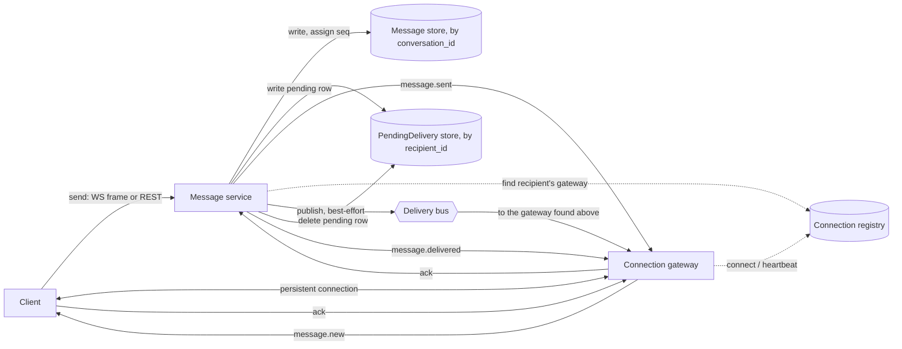

Worth confirming before designing: what happens when a user opens a second connection while "single device per user" should hold (assumed here: the new connection replaces the old one, and the server closes the old one), and whether the sender needs to see the delivery receipt exactly once even though the acknowledgement machinery underneath might fire more than once (assumed yes — the client de-duplicates that signal the same way it de-duplicates messages).

### Requirements and scale

**Message rate.** $50{,}000{,}000$ daily actives sending 24 messages a day each gives

$$50{,}000{,}000 \times 24 = 1{,}200{,}000{,}000 \text{ messages/day,}$$

$$\text{avg QPS} = \frac{1{,}200{,}000{,}000}{86{,}400} \approx 13{,}889 \text{ messages/s.}$$

Consumer messaging peaks less sharply than a workplace tool's business-hours peak, since usage spreads across evening hours in every time zone rather than concentrating in one region's working day; a 3x peak-to-average ratio puts peak throughput at about $41{,}667$ messages/s. Because a conversation has exactly one recipient, this is also the delivery rate and the write rate into the message store — unlike a channel-based design, nothing here multiplies a message by a membership count on its way out.

**Connections and the tier that holds them.** At peak, 8% of the $50{,}000{,}000$ daily actives are connected at once: $4{,}000{,}000$ users. Single device per user makes this figure the concurrent-connection count directly, with no per-user device multiplier. Budgeting 200,000 connections per instance — bounded by per-connection heartbeat bookkeeping, not raw socket memory, which a modern event-loop server holds far more of — needs $\lceil 4{,}000{,}000/200{,}000\rceil=20$ instances bare; 20% headroom for rolling deploys and uneven load brings the fleet to $24$.

**Storage.** A stored message needs a globally unique message id (16 bytes), its conversation id (16 bytes), a per-conversation sequence number (8 bytes), the sender's id (8 bytes), a client-generated idempotency key kept alongside the row so a retried send can be recognized (16 bytes), a server timestamp (8 bytes), and its body — averaging 128 bytes of text against the 4 KiB maximum, most messages being much shorter than the limit. That is $200$ bytes/message: $1{,}200{,}000{,}000\times200\text{ B}=240{,}000{,}000{,}000$ B, $240$ GB/day. At $365$ days/year that is $87{,}600$ GB, $87.6$ TB/year before replication; at 3x replication, about $262.8$ TB/year — large enough to need sharding, nothing that needs more than a well-sharded relational store.

**Presence signaling cost.** Each connected client sends a lightweight heartbeat every 15 s; a presence record for that user, keyed by user id, carries a TTL of twice the interval, 30 s — so a connection that has gone dark is presumed offline within 30 s of its last heartbeat. Recording *last seen* in the durable user record on every heartbeat would cost $4{,}000{,}000/15\approx266{,}667$ writes/s — about $6.4$ times the peak message rate — for a value nobody reads between transitions; the design below writes it only once, on the transition to offline.

Pushing every presence transition to a list of interested contacts is worth pricing before choosing it, too. By Little's law, with an average connected session of $1{,}000$ s, connections arrive — and, in steady state, leave — at $4{,}000{,}000/1{,}000=4{,}000$/s each way, about $8{,}000$ transitions/s at peak. Pushing each one to an average of 40 people who would plausibly want to know about it — everyone with a recent conversation open — costs $8{,}000\times40=320{,}000$ pushes/s, about $7.7$ times the peak message rate, to carry a signal that a check made only at the moment it is actually needed (the presence deep dive below) gets for a small fraction of that cost.

### Data model and API

**Conversation** — `conversation_id` (built from the pair of participants, below), `user_a`, `user_b` (the pair, stored with `user_a < user_b`), `last_seq` (the most recent sequence number handed out, incremented in the same transaction as each new message), `created_at`. Shard key: `conversation_id`.

`conversation_id` is built from the ordered pair of participant ids — `f"{min(user_a, user_b)}:{max(user_a, user_b)}"` — so it is the same value regardless of who sends first, and there is exactly one row per unordered pair of users, with nothing to look up and no collision to handle.

**Message** — `conversation_id`, `seq` (per-conversation position, gapless — advanced the same way `Conversation.last_seq` is, inside one transaction), `message_id` (a globally unique, time-sortable id naming a message outside the context of its conversation), `sender_id`, `client_msg_id` (the sender's idempotency key, unique together with `(conversation_id, sender_id)`), `body`, `server_ts`. There is no delivery-status field: whether a message has been delivered is entirely represented by whether a matching row still exists in `PendingDelivery`, so the two are never a separate write apart from being out of sync with each other. Shard key: `conversation_id` — the same shard as its `Conversation` row, so advancing `seq` is a single-shard transaction.

**PendingDelivery** — one row per message its recipient has not yet acknowledged: `recipient_id`, `conversation_id`, `seq` (a pointer, not a copy of the body — the body is read from `Message` when a row is drained), `expires_at` (a TTL; see the offline-queue deep dive). Primary key `(recipient_id, conversation_id, seq)`. Shard key: `recipient_id` — deliberately different from `Message`'s, because its access pattern is different: "everything pending for user X across every conversation they have," not "this conversation's messages."

**ConnectionRecord** (in a fast external key-value store, not the relational store above; this is what the rest of this page calls the connection registry) — `presence:{user_id}` → `{instance_id}`, TTL 30 s, refreshed on every heartbeat. One record answers two questions: whether this user is online (the key exists) and, if so, which instance holds their connection (the value) — used by anything that needs to push to them. This is a separate concern from the delivery bus discussed in the deep dives, even though both can live on the same fleet.

API over a client's persistent connection (WebSocket), client → server:

- `send {client_msg_id, recipient_id, body}` — the server resolves or creates the conversation from `(sender_id, recipient_id)`; the client never has to know or cache a `conversation_id` to send.
- `ack {conversation_id, seq}` — the recipient confirms durable local receipt of one message.
- `heartbeat {}` — sent every 15 s.
- `presence.query {user_id}` — checked once, on demand, for the peer of a conversation the user has open (not subscribed to; see the presence deep dive).

Server → client:

- `message.new {conversation_id, seq, message_id, sender_id, body, server_ts}` — a live push.
- `message.sent {conversation_id, seq, message_id, client_msg_id, server_ts}` — acknowledges the sender's own `send`, echoing `client_msg_id` so a client that resent after a timeout can match the reply to the right local placeholder.
- `message.delivered {conversation_id, seq}` — sent to the sender once the recipient acknowledges.
- `backlog {items: [{conversation_id, seq, message_id, sender_id, body, server_ts}], more}` — sent right after connecting, draining what is queued for this user; `more` marks whether another page follows.
- `presence.result {user_id, online}` — the reply to `presence.query`.

REST, for a client with no open connection or for anything not tied to one:

- `POST /v1/messages` — `{client_msg_id, recipient_id, body}` → `{message_id, conversation_id, seq, server_ts}`. Same handler, and the same idempotency on `client_msg_id`, as the `send` frame.
- `GET /v1/conversations` — the caller's conversations, each with its peer, `last_seq`, and a preview — for initial load.
- `GET /v1/conversations/{conversation_id}/messages?before_seq=&limit=` — paginated history, newest first.
- `GET /v1/queue` — the caller's queued (undelivered) messages across every conversation; the REST equivalent of `backlog`, for a client that polls instead of holding a connection, or that wants to re-fetch after only partially applying a previous batch.
- `POST /v1/messages/{message_id}/ack` — the REST equivalent of the `ack` frame.
- `GET /v1/presence/{user_id}` — the REST equivalent of `presence.query`.

### Architecture



A `send` — over the sender's open connection if it has one, over REST otherwise — reaches the message service, which resolves `conversation_id` from `(sender_id, recipient_id)`, opens a transaction on that conversation's shard, increments `last_seq`, and inserts the new `Message` row with the resulting `seq`. On commit it replies `message.sent` to the sender — the point the 300 ms target is measured against, since that is what the sender's own screen is waiting on; the recipient may still be a step away. Before replying, in the same request, it also writes a `PendingDelivery` row for the recipient — on the recipient's shard, a different one from the conversation's, so this is a second, separate write rather than part of the first write's transaction; what guarantees it always eventually happens, even across a crash between the two writes, is in the delivery-semantics deep dive below.

With the pending row in place, the message service checks the connection registry for the recipient's user id. If it holds a live entry, the message service publishes the message on the delivery bus addressed to that entry's gateway, best-effort; that gateway forwards it to the recipient's connection as `message.new`. If the recipient's client applies it and replies `ack`, the message service deletes the `PendingDelivery` row and pushes `message.delivered` to the sender. If the registry has no entry for the recipient — they are offline — or the publish is lost, or it reaches a connection that has since closed, nothing happens on this path, and nothing needs to: the pending row is still there. It is found the next time that recipient connects. Immediately after registering the new connection, the gateway asks the message service for everything pending; the message service reads `PendingDelivery` on that recipient's shard, fetches each referenced message's body from `Message`, and sends it all back as one or more `backlog` frames. The client applies each item exactly as it would a live push and acks it the same way, which deletes the row and, if the original sender is still connected, still triggers `message.delivered` — a message delivered on reconnect looks, from the sender's side, identical to one delivered live, only later.

### Deep dives

**(a) The tier that holds client connections.** WebSocket over TLS is chosen over long polling. The requirement is fundamentally push-shaped — a connected recipient must be told the instant a message arrives — and bidirectional, since the same client also sends `send`, `ack`, and `heartbeat`; one WebSocket carries all of it over a single connection. Long polling approximates push by having the client hold an HTTP request open until the server has something, then immediately reopen another, which pays connection and header setup on every cycle; at $4{,}000{,}000$ concurrent clients, that many requests continuously reopening would itself be a meaningful load on the edge layer, on top of the actual message traffic it carries no better than a WebSocket already does.

Each gateway instance keeps an in-memory map from the `user_id`s connected to it to their live connection object — used only to hand a push, or a heartbeat's TTL refresh, to the right local socket once that instance already holds it. The harder problem is different: the message service, publishing on behalf of a sender it is handling, is a separate process from every gateway and has no idea which one, if any, holds the recipient. That is exactly what the connection registry answers. A gateway writes `presence:{user_id} -> {instance_id}` on connect, with a 30 s TTL refreshed on every heartbeat, and deletes it on a clean disconnect; anyone that needs to reach that user reads the same key.

The alternative is consistent hashing: every instance computes, from a hash of `user_id` and a shared view of which instances are alive, which instance a user belongs on, with no lookup at all. That removes the registry read, but only in principle — nothing stops a client's load balancer from connecting it to an instance other than the one the hash names, so consistent hashing is really a placement policy, which needs a coordination service (etcd or ZooKeeper) telling each instance the slice of the ring it owns, and a rebalance step every time the fleet scales or an instance dies, during which some share of connections compute a stale owner until the new assignment propagates. A registry lookup against a store already in the architecture for presence costs a sub-millisecond read and handles fleet churn by simply overwriting or expiring a key, no rebalance protocol at all — which is why it is chosen here. Consistent hashing earns its keep only when the lookup itself, not the coordination it replaces, is the bottleneck, and a small key-value store serving one short-lived key per online user is not that.

**(b) Delivery semantics.** The guarantee actually provided, end to end, is at-least-once: a `PendingDelivery` row is not deleted until its recipient's client has acknowledged the message, and nothing about the delivery bus is trusted to be lossless, so the same message can genuinely reach a client more than once — a live push followed by a `backlog` redelivery because the `ack` for the live push was itself lost, most commonly. What stops a user from ever seeing a duplicate is dedup on the client, by `(conversation_id, seq)`: an item that arrives — live or in a backlog — with a `seq` the client has already applied for that conversation is acknowledged, since acking something the client already has is always safe, but it is never rendered a second time. Promising exactly-once instead — never delivering a second copy in the first place — would need the server and the client to agree, without any extra round trip, on whether a given attempt had already been observed, exactly the coordination a flaky network makes expensive; at-least-once plus a cheap, purely local dedup check sidesteps it, and is what this design uses.

A second, independent idempotency key covers the other direction. A `client_msg_id`, chosen by the sender when it first tries a `send` and reused on every retry of that same attempt (a timeout with no reply, most commonly — the client cannot tell whether the request was lost or only its response was), is enforced unique on `(conversation_id, sender_id, client_msg_id)`; an insert that collides with an already-committed row is recognized as a retry and returns that row's `{message_id, seq}` instead of assigning a new one, so a request that reaches the server twice never becomes two messages. This key and `seq`-based dedup solve different problems and neither substitutes for the other: `client_msg_id` stops a retried `send` from being stored twice, before any `seq` has even been assigned to compare; `seq` dedup stops an already-stored message from being shown twice once it is being redelivered to its recipient.

The same idempotency closes the two-write gap from the architecture walk-through. If the message service crashes after committing the `Message` row but before the `PendingDelivery` row lands, the message exists with nothing holding a place for its delivery, and there is no request left to retry. The fix does not depend on one surviving: a background sweep, running continuously, scans recently committed `Message` rows on each conversation shard and, for any whose `(recipient_id, conversation_id, seq)` has no matching `PendingDelivery` row, inserts one — the same insert the original write path would have made, idempotent on that same primary key, so running it against a row that already exists (the overwhelmingly common case) is a no-op. `Message` is the durable fact that something was accepted; `PendingDelivery` is a derived index of what is still owed, and the sweep is what keeps the index eventually consistent with the fact, independent of whether any single write path runs to completion.

Ordering is per conversation only — nothing here defines, or needs, an order between a message in one conversation and a message in another, and a design that tried to give one (a single counter shared by every conversation in the system) would force every message, in every conversation, through one serialized write path for a guarantee this problem never asked for. Within one conversation, `seq` is gapless by construction, but a client can still receive two of its own messages out of order — a live push can outrun a `backlog` still catching up an older gap, for instance — so the client keeps a `next_expected` counter per conversation and buffers an arrival whose `seq` is ahead of it instead of displaying it immediately; an arrival that fills the front of the buffer is displayed and the counter advances past every consecutive `seq` now available, cascading through anything the buffer already held. A gap nothing already in flight closes is closed by the same mechanism as any other: the sender's write already guarantees the row exists, so a reconnect's `backlog` — or, on a connection that never dropped, a periodic catch-up call below the client's watermark — eventually supplies it.

**(c) The offline queue and reconnecting.** `PendingDelivery` is this design's entire offline-delivery mechanism: a row exists for exactly as long as a message is owed to its recipient, regardless of why — never pushed because the recipient was offline, pushed and lost on a lossy bus, or pushed, displayed, and never acknowledged because the client crashed before the `ack` went out. All three end up in the same place and are recovered the same way, which is what makes "resend everything the recipient has not acknowledged" and "drain the queue" the same operation rather than two.

A row carries a 14-day `expires_at`. Expiry does not delete the message — `Message` rows are retained indefinitely, per the requirements — it only stops the fast catch-up path from resurfacing that particular message on the next connect; a client away longer than that finds it another way. `GET /v1/conversations` returns each conversation's current `last_seq`, so a client compares that against the highest `seq` it has locally and, for any conversation more than 14 days behind, pages back through `GET /v1/conversations/{id}/messages?before_seq=` instead — the same endpoint used for scrolling up through ordinary history. Fourteen days is generous against the 30 s presence TTL — about $14\times86{,}400/30=40{,}320$ times as long — because the offline queue exists to survive a real absence, not a brief reconnect blip, and its cost is one small row per pending message, never the size of anything the recipient will actually see.

Two alternatives were not chosen. Relying on the delivery bus's own replay — keeping messages in the bus and having a reconnecting client resume from its last consumed position — ties correctness to whichever bus technology sits in front of it, needs a durable, per-user consumption position tracked somewhere for every one of $50{,}000{,}000$ daily actives instead of one small table keyed by whoever actually has something pending, and conflates the bus's own operational retention with one user's unread state. A dedicated queue, independent of the bus, is what lets the bus be treated as best-effort in the first place — the trade-off the delivery-bus deep dive below depends on. Copying each message's full body into its `PendingDelivery` row, instead of a pointer read from `Message` on drain, was also rejected: it stores most messages twice for no benefit beyond saving one indexed read at drain time, a read that happens only for messages not delivered live — a minority of the $41{,}667$ peak messages/s the instant the registry is actually checked, not the whole rate.

**(d) Presence.** A connected client sends `heartbeat` every 15 s; the owning gateway refreshes that user's connection-registry TTL to 30 s each time. "Online" is the key's existence; "offline" is not a message anyone sends, it is the absence of the key once 30 s pass with no refresh — discovered only when something next reads it, not announced the instant it happens. TCP's own keepalive is not used for this: its default idle time before the first probe is on the order of hours (2 hours on Linux), and even shortened per socket with `TCP_KEEPIDLE`/`TCP_KEEPINTVL`, what a probe confirms is answered by the peer's kernel, not its application — a frozen client, or a tab the OS has aggressively backgrounded, still has its TCP stack acknowledge a keepalive probe while the process itself has stopped doing anything, including sending the heartbeat this design actually reads. An application-level heartbeat that the server itself times out is a signal only a live application can produce, and gives a bound the design actually needs and controls.

What the registry deliberately does not do is announce a transition to anyone. `presence.query` reads it lazily, once, for the specific peer of a conversation a user actually has open — bounded by how many conversations one person has open at a time, essentially never more than a handful — rather than being pushed to a subscriber list that would have to be maintained and fanned out to on every connect and disconnect. The requirements section already prices that alternative: about $320{,}000$ pushes/s at peak against $41{,}667$ peak messages/s, to carry a signal whose entire value is answering "is this person online right now" — which a query already answers the moment it is asked, with staleness bounded by the same 30 s accepted elsewhere in this design. The send path itself never needs a presence check at all: it always writes `PendingDelivery` first regardless of what the registry would say, and only consults the registry afterward to decide whether to also attempt a live push. Presence is a user-interface convenience here, exactly as the requirements describe it, never load-bearing for delivery.

**(e) The delivery bus — Kafka versus Redis.** Everything durable already happened before the bus is touched: the write `message.sent` is acknowledged against, and the `PendingDelivery` row that guarantees eventual delivery, are both committed to the database first. The bus's only job is getting a live copy to a connected recipient sooner than waiting for their next reconnect would — a latency optimization sitting on top of a design that is already correct without it. That reframes the question: the bus does not need to be durable, ordered, or even reliable, because nothing downstream trusts it to be any of those things — a message the bus drops is exactly as recoverable as one whose recipient was simply never online, since both leave the `PendingDelivery` row in place untouched. What is actually being chosen is a mechanism for one thing: getting a small message to whichever single gateway instance currently holds one specific user's connection, as fast as possible, with silently dropping it an acceptable failure mode.

Redis — Pub/Sub, or Streams for a little extra redundancy — fits that job well. A channel is nothing more than a list of subscriber sockets held by whichever node owns it; a channel with no subscriber, which is most of the registered population at any instant, costs nothing beyond a hash computation to find it empty, so addressing one channel per online user is essentially free, and publishing is a single-digit- millisecond operation. A handful of nodes, sharded by hashing `recipient_id`, comfortably cover the $41{,}667$ publishes/s at peak — one per message, to at most one recipient's channel — with each node's achievable throughput for a payload this small an order of magnitude or more above what any one shard sees once the recipient population is spread across even a small cluster. Pub/Sub delivers only to whatever is subscribed at the instant of publish and drops the message otherwise, which costs nothing here because `PendingDelivery` already provides the actual redelivery guarantee; layering Streams' own persistence and consumer-group replay on top would mean paying for durability a second time, on a component that does not need to provide any.

Kafka is a durable, partitioned, replicated log built for a bounded number of high-throughput topics consumed by groups of readers, not for addressing hundreds of millions of individual users. Getting Redis's "reach whichever gateway currently holds user X" behavior out of Kafka the same way — a topic per user — does not work at this population: every topic carries real, fixed cluster metadata (partition assignment, replica sets, in-sync-replica state) that every broker and controller must hold whether or not the topic ever carries traffic. At $250{,}000{,}000$ registered users — any of whom could be a delivery target, active today or not — even a conservative per-topic overhead of about 20 KB multiplies out to $250{,}000{,}000\times20\text{ KB}=5$ TB of metadata a cluster would have to hold just for the topics to exist, before a single message flows. Used instead the way Kafka is meant to be — a bounded number of partitions on one topic, `recipient_id` hashed across them — a gateway holding a few hundred thousand of the many millions of possible recipients must still consume from most of that partition space to catch messages meant for them, reading far more traffic than it ever delivers locally, and every scaling event or deploy of the gateway fleet triggers a consumer-group rebalance that pauses the reassigned partitions — disruptive on a path meant to be delivering messages continuously, and recurring on every deploy, not only during an incident.

The internals worth being precise about: a *partition* is an ordered, append-only log; order is defined only within one partition, never across partitions of the same topic — the same shape as this design's own per-conversation-only ordering, and for the same reason, since a single total order would force every write through one serialized path. A *consumer group* is a set of consumer processes splitting a topic's partitions among its members, each partition owned by exactly one member at a time; a *group coordinator* broker tracks membership and triggers a *rebalance* — partitions reassigned among the surviving members — whenever one joins, leaves, or is judged dead, pausing consumption of the affected partitions until it completes. Durability comes from replication: each partition is copied to several brokers, and the *in-sync replica* (ISR) set is whichever copies are caught up within a bounded lag; a write with `acks=all` is acknowledged only once every ISR member has it, and if a partition's leader broker dies, a new leader is elected from the remaining ISR members — electing a replica that had fallen out of the ISR would mean accepting data already lost, and is only possible with unclean leader election explicitly enabled. *Log compaction* is a retention mode that keeps only the latest record per key forever instead of expiring by age or size — the wrong fit for a log of individual messages, where every one matters and none should be silently replaced by a later one, but the right fit for a topic whose job is "the current state per key," such as a durable, replicated copy of presence state keyed by `user_id`, if a design wanted that instead of the lighter TTL key used here.

Redis is the choice for this system: durability is already handled elsewhere, so the bus does not need to provide it, and per-user addressing is what Redis channels suit and Kafka's topic/partition model does not. Kafka is the right choice when the log itself is a product requirement, not just a delivery mechanism — something downstream needs to replay hours or days of the message stream, rebuilding a search index or feeding an analytics pipeline — or when delivery targets are naturally few and coarse-grained, a bounded number of channels each with many subscribers, which plays to a partition's strength of many consumers sharing one ordered log instead of against it.

### Follow-ups

- Multi-device: scope `PendingDelivery` by `(recipient_id, client_id)` instead of just `recipient_id`, and the connection registry by `(user_id, client_id)`, so each device acknowledges independently; cap the number of registered devices per account to bound how many live pushes and registry lookups one message now costs.
- Read receipts: add a client-driven `read_upto {conversation_id, seq}` signal, stored as one cursor per `(user_id, conversation_id)` rather than per message, and delivered to the sender over the same acknowledgement channel `message.delivered` already uses — a coarser signal, not a new mechanism.
- End-to-end encryption: `body` becomes ciphertext the server never opens; `seq`, dedup, and ordering all operate on the envelope and are unaffected, but multi-device now also needs every device to hold, or be given, the keys for a conversation, not just a place in the connection registry.
- A single very active account — a business or support line messaging a large and constantly growing set of distinct users — does not create one hot `Conversation` row, since each of its conversations has a different `conversation_id` and hashes independently, but it can concentrate rows on one shard of `PendingDelivery` when many people happen to message it back around the same time; bound that with a per-recipient write-rate limit, or a hash suffix splitting one hot recipient across more than one physical shard.
- A regional outage that drops and then reconnects a large fraction of the connected fleet at once turns into a burst of `backlog` reads against `PendingDelivery` and `Message`; since reconnect and the periodic sweep already share the same simple, indexed queries, absorbing the burst is a capacity question — provisioning those shards for a multiple of steady-state read load — rather than a separate code path.

```python
import math
import random
from collections import Counter

# ---- message rate ----
registered_users = 250_000_000
dau = 50_000_000
assert dau / registered_users == 0.2

msgs_per_user_per_day = 24
total_msgs_per_day = dau * msgs_per_user_per_day
assert total_msgs_per_day == 1_200_000_000

avg_qps = total_msgs_per_day / 86_400
assert round(avg_qps) == 13_889

peak_factor = 3
peak_qps = avg_qps * peak_factor
assert round(peak_qps) == 41_667

# ---- connections and the tier that holds them ----
peak_online_frac = 0.08
peak_connections = dau * peak_online_frac
assert peak_connections == 4_000_000

conns_per_instance = 200_000
instances_bare = math.ceil(peak_connections / conns_per_instance)
assert instances_bare == 20
headroom = 0.2
instances_total = math.ceil(instances_bare * (1 + headroom))
assert instances_total == 24

# ---- storage ----
id_bytes = 16 + 16 + 8 + 8 + 16 + 8   # message_id, conversation_id, seq, sender_id, client_msg_id, server_ts
avg_body_bytes = 128
row_bytes = id_bytes + avg_body_bytes
assert id_bytes == 72
assert row_bytes == 200

daily_bytes = total_msgs_per_day * row_bytes
daily_gb = daily_bytes / 1e9
assert daily_gb == 240.0

annual_gb = daily_gb * 365
annual_tb = annual_gb / 1000
assert round(annual_tb, 1) == 87.6

replication = 3
annual_tb_replicated = annual_tb * replication
assert round(annual_tb_replicated, 1) == 262.8

# ---- presence signaling cost ----
heartbeat_interval_s = 15
presence_ttl_s = 2 * heartbeat_interval_s
assert presence_ttl_s == 30

naive_last_seen_writes_per_s = peak_connections / heartbeat_interval_s
assert round(naive_last_seen_writes_per_s) == 266_667
assert round(naive_last_seen_writes_per_s / peak_qps, 1) == 6.4

avg_session_s = 1_000
connect_rate = peak_connections / avg_session_s          # Little's law: arrivals = number in system / mean time
assert connect_rate == 4_000
transition_rate = connect_rate * 2                        # a connect and a disconnect each flip presence
assert transition_rate == 8_000

avg_contacts_pushed = 40
presence_push_avoided = transition_rate * avg_contacts_pushed
assert presence_push_avoided == 320_000
assert round(presence_push_avoided / peak_qps, 1) == 7.7

# ---- offline-queue TTL vs. presence TTL ----
inbox_ttl_days = 14
ttl_ratio = inbox_ttl_days * 86_400 / presence_ttl_s
assert ttl_ratio == 40_320

# ---- Kafka topic-metadata cost of one topic per user ----
kafka_topic_overhead_bytes = 20_000
kafka_metadata_bytes = registered_users * kafka_topic_overhead_bytes
kafka_metadata_tb = kafka_metadata_bytes / 1e12
assert kafka_metadata_tb == 5.0

print("all requirements-and-scale numbers check out")


# ---- delivery simulation: per-conversation order, no shown duplicates, full offline recovery ----
class ChatClient:
    """One recipient's local view: reconciles out-of-order, possibly-repeated arrivals into one
    gapless, ordered, duplicate-free display sequence per conversation."""

    def __init__(self):
        self.next_expected: dict[int, int] = {}   # conversation_id -> next seq to display
        self.buffered: dict[int, dict[int, bool]] = {}   # conversation_id -> {seq: held}
        self.applied: dict[int, list[int]] = {}    # conversation_id -> displayed seqs, in display order
        self.redundant = 0                          # arrivals already displayed or already buffered

    def receive(self, conversation_id: int, seq: int) -> None:
        ne = self.next_expected.setdefault(conversation_id, 1)
        buf = self.buffered.setdefault(conversation_id, {})
        applied = self.applied.setdefault(conversation_id, [])
        if seq < ne or seq in buf:
            self.redundant += 1
            return
        buf[seq] = True
        while ne in buf:
            applied.append(ne)
            del buf[ne]
            ne += 1
        self.next_expected[conversation_id] = ne


def run_delivery_trial(seed: int, n_conversations: int = 4, n_messages: int = 25,
                        p_offline: float = 0.4, p_push_drop: float = 0.3,
                        p_push_duplicate: float = 0.2, p_spurious_redrain: float = 0.15) -> Counter:
    """Sends n_messages in each of n_conversations, interleaved in random order, through a model
    of the message service -- which always writes a pending row before attempting a live push --
    and a flaky bus that can drop or duplicate that push, to one ChatClient; an unconditional final
    drain of whatever is still pending models a reconnect, exactly this design's own guarantee."""
    rng = random.Random(seed)
    next_seq = {c: 1 for c in range(n_conversations)}
    pending: dict[int, dict[int, bool]] = {c: {} for c in range(n_conversations)}
    client = ChatClient()
    stats: Counter = Counter()

    order = [c for c in range(n_conversations) for _ in range(n_messages)]
    rng.shuffle(order)

    for c in order:
        seq = next_seq[c]
        next_seq[c] += 1
        pending[c][seq] = True                     # always written before any push is attempted
        stats["sent"] += 1

        if rng.random() > p_offline:                # the recipient is connected right now
            stats["push_attempts"] += 1
            copies = 0
            if rng.random() > p_push_drop:
                copies = 2 if rng.random() < p_push_duplicate else 1
            else:
                stats["push_dropped"] += 1
            for _ in range(copies):
                stats["push_delivered_copies"] += 1
                client.receive(c, seq)
                pending[c].pop(seq, None)            # ack on receipt, whether or not newly displayed

        if rng.random() < p_spurious_redrain:        # models an extra reconnect mid-stream
            stats["spurious_redrains"] += 1
            for s in sorted(pending[c]):
                stats["drain_deliveries"] += 1
                client.receive(c, s)
            pending[c].clear()

    for c in range(n_conversations):                 # the final, unconditional reconnect drain
        for s in sorted(pending[c]):
            stats["drain_deliveries"] += 1
            client.receive(c, s)
        pending[c].clear()

    for c in range(n_conversations):
        assert client.applied[c] == list(range(1, n_messages + 1)), (seed, c, client.applied[c])
        assert pending[c] == {}
    stats["redundant"] = client.redundant
    return stats


totals: Counter = Counter()
for seed in range(30):
    totals.update(run_delivery_trial(seed))

assert totals["sent"] == 30 * 4 * 25
assert totals["push_dropped"] > 0            # the bus genuinely lost some live pushes
assert totals["drain_deliveries"] > 0        # the offline-queue drain path was genuinely exercised
assert totals["redundant"] > 0               # a redelivery genuinely reached the client more than once

print("delivery simulation confirms per-conversation order, no shown duplicates, and full offline recovery")
```
