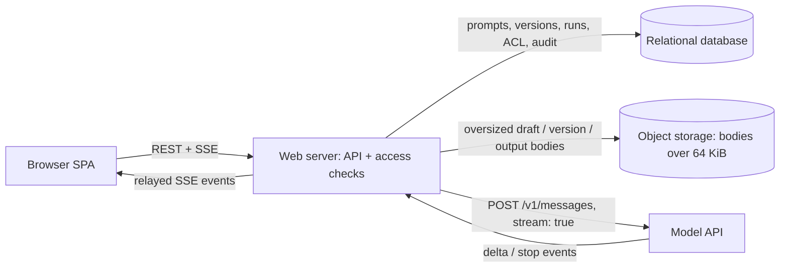

Two points worth confirming before designing: whether a run's output ever feeds automatically into the next run, the way a chat turn would (assumed no — a run reads only the version or draft's own saved messages; continuing a thread means copying the reply in as a new `assistant` message and running again, which keeps this a tool for iterating on one call at a time rather than a chat client), and whether a user account belongs to more than one organization (assumed no — the ordinary case for a seat-based developer tool, which is what gives "organization scope" in the permissions model a single, unambiguous meaning per request).

### Requirements and scale

**Run rate.** With 15,000 daily active users running a prompt about 15 times a day each, $15{,}000 \times 15 = 225{,}000$ runs/day, averaging $225{,}000 / 86{,}400 \approx 2.60$ runs/sec system-wide. 72% of that volume, 162,000 runs, lands inside the 12-hour (43,200 s) window most customers' working hours share, an average of exactly $162{,}000 / 43{,}200 = 3.75$ runs/sec across that window; at a 2x burst factor for the single busiest minute, the design peak is $3.75 \times 2 = 7.5$ runs/sec started. A run's output streams for $400 / 50 = 8$ seconds on average (400 tokens at 50 tokens/sec). By Little's law, $L = \lambda W$, the expected number of concurrently open streams at that peak is $7.5 \times 8 = 60$ — well within what one modest application server holds open; the interesting parts of this system are not its request rate.

Saves are rarer than runs: 2 saved versions per active user per day give $15{,}000 \times 2 = 30{,}000$ saves/day, about $30{,}000 / 86{,}400 \approx 0.35$/sec on average — an order of magnitude below the run rate, which is expected, since only some iterations are worth naming and keeping.

**Version and run storage.** $250{,}000$ users at 12 prompts each give $250{,}000 \times 12 = 3{,}000{,}000$ prompts; at 6 saved versions per prompt over its lifetime, $3{,}000{,}000 \times 6 = 18{,}000{,}000$ versions. Each version row holds its content (the 1.5 KB average draft, budgeted at 1,500 bytes) plus metadata — parent pointer, author, label, timestamps, the model and parameters, the declared variables — budgeted at 300 bytes, 1,800 bytes/version in total; $18{,}000{,}000 \times 1{,}800 \approx 30.2$ GiB of version storage. A run row is metadata (300 bytes, the same budget as a version's) plus its variable bindings (about 100 bytes) plus its full output text, 400 tokens at roughly 4 bytes/token = 1,600 bytes, 2,000 bytes/run in total; $225{,}000$ runs/day is $450{,}000{,}000$ bytes/day, about 429 MiB/day, $\approx 153$ GiB/year at a steady run rate — the fastest-growing table by far, and the one a retention or archival policy would target first (deep dive (d)).

**The size gap.** The average prompt (1.5 KB) and the largest one the system accepts (8 MiB) differ by roughly four orders of magnitude. At about 4 bytes/token, 8 MiB is around 2.1 million tokens — far beyond any model's context window, so a prompt anywhere near that size is not something a single run will send in full; it is pasted reference material a user is trimming down, and the design has to keep the editor responsive while they do it (deep dive (d)).

### Data model and API

**Organization** — `org_id`, `name`, `monthly_budget_micros` (a spending cap on model calls, deep dive (d)), `created_at`. **User** — `user_id` (issued by the identity service), `org_id`, `display_name`, `created_at`; authentication itself lives in the identity service, and this design assumes exactly one organization per user, as confirmed above.

**Prompt** — `prompt_id`, `org_id`, `owner_id`, `title`, `draft` (JSONB: `{system_prompt, messages, variables, model, params}`), `draft_ref` (nullable; set instead of inlining `draft` once its serialized size passes the inline threshold, deep dive (d)), `draft_bytes`, `draft_etag` (bumped on every draft write, deep dive (b)), `latest_version_id` (nullable, FK to `PromptVersion`, null until the first save), `created_at`, `updated_at`, `deleted_at` (nullable, soft delete).

**PromptVersion** — immutable. `version_id`, `prompt_id`, `seq` (an integer counting 1, 2, 3, ... in save order, `UNIQUE(prompt_id, seq)`), `parent_version_id` (nullable, FK to `PromptVersion`: the version this one's draft was last loaded from, deep dive (b)), `author_id`, `label` (nullable, user-given), `body` / `body_ref` / `body_bytes` (the same inline-or-referenced split as the draft), `created_at`, `deleted_at` (nullable, deep dive (b)).

**Run** — `run_id`, `prompt_id`, `version_id` (nullable, FK to `PromptVersion`; null means the run targeted the live draft), `requested_by`, `model`, `params` (a copy of the parameters actually used, not read through `version_id`, deep dive (b)), `variables` (the bindings supplied), `status` (`streaming | completed | failed | cancelled`), `output_text` / `output_ref` / `output_bytes`, `input_tokens`, `output_tokens`, `cost_micros`, `latency_ms`, `error` (nullable), `test_case_id` (nullable, FK), `batch_id` (nullable, set when the run is one of a test-case evaluation batch), `started_at`, `finished_at`.

**TestCase** — `test_case_id`, `prompt_id`, `name`, `variables`, `notes` (nullable), `created_at`.

**AclEntry** — a direct, principal-to-role grant (deep dive (c)). `acl_id`, `prompt_id`, `principal_type` (`user | org`), `principal_id`, `role` (`viewer | editor | owner`), `granted_by`, `created_at`; `UNIQUE(prompt_id, principal_type, principal_id)`.

**ShareLink** — a bearer-token grant, for a recipient who is not resolved to a principal ahead of time. `token` (primary key, 128 random bits), `prompt_id`, `version_id` (nullable — pins an exact version; unset resolves to `latest_version_id`), `scope` (`public | authenticated`), `role` (`viewer | editor`; `editor` is only legal when `scope = 'authenticated'`, deep dive (c)), `expires_at` (nullable), `revoked_at` (nullable), `created_by`, `created_at`.

**AuditLog** — append-only. `audit_id`, `org_id`, `actor_id`, `action` (deep dive (d) lists the full set), `target_type`, `target_id`, `metadata` (a small, action-specific JSON payload), `created_at`.

Indexes, each serving one query above: `Prompt` — `(org_id, updated_at DESC)` for an organization's prompt browser, `(owner_id, updated_at DESC)` for "my prompts." `PromptVersion` — the `UNIQUE(prompt_id, seq)` constraint already serves ordered version history, since `seq` increases with `created_at`, with no second index needed. `Run` — `(prompt_id, started_at DESC)` for a prompt's run history, `(version_id, started_at DESC)` for "every run of this version" in the compare and evaluate views, and a partial index on `(batch_id) WHERE batch_id IS NOT NULL` for collecting one evaluation batch, since most runs are ad hoc and never set it. `TestCase` — `(prompt_id)`. `AclEntry` — `(principal_type, principal_id)`: "every prompt I, or my organization, can reach" is a join from this side, not from `Prompt`, and every prompt list the product shows other than "my prompts" runs through it. `ShareLink` — `(prompt_id)` for a prompt's own "manage sharing" panel; the primary key on `token` already serves the public resolve path. `AuditLog` — `(org_id, created_at DESC)` for an organization admin's audit view, `(target_type, target_id, created_at DESC)` for one object's full history.

**Core APIs.** Every prompt-scoped call below filters by the caller's resolved access (deep dive (c)); an id for a prompt the caller cannot reach returns `404`, not `403`, so a guess reveals nothing about whether the id even exists.

- `POST /v1/prompts` — create. Body `{title}`; returns a blank `{prompt_id, draft, draft_etag, created_at}` with default model and parameters and empty content.
- `GET /v1/prompts` — list prompts the caller can reach, paginated, newest-updated first; returns summaries only — `{prompt_id, title, owner, updated_at, latest_version_seq}` — never draft or version content.
- `GET /v1/prompts/{id}` — one prompt's metadata plus its current draft; a draft in object storage (deep dive (d)) resolves as `{draft_ref, draft_bytes, download_url}`, a signed URL, instead of being embedded.
- `PATCH /v1/prompts/{id}/draft` — replace the draft. Requires `If-Match` on the `draft_etag` last read. Body `{system_prompt, messages, variables, model, params}` — the whole draft, not a partial merge (deep dive (b)). Returns `{draft_etag, updated_at}`, or `412 Precondition Failed` with the current draft and `draft_etag`.
- `POST /v1/prompts/{id}/versions` — save the draft as a new version. Requires the same `If-Match` as a draft edit (deep dive (b)). Body `{label?}`; returns `{version_id, seq, created_at}`.
- `GET /v1/prompts/{id}/versions` / `GET /v1/prompts/{id}/versions/{version_id}` — list newest-first (`{version_id, seq, label, author, created_at, body_bytes, deleted_at}`), or fetch one version's full content.
- `DELETE /v1/prompts/{id}/versions/{version_id}` — soft-delete (owner only). Returns `{deleted_at, latest_version_id}` (deep dive (b)).
- `POST /v1/prompts/{id}/versions/{version_id}/restore` — clear `deleted_at`; `404` if hard-purged (deep dive (b)).
- `POST /v1/prompts/{id}/runs` — start a run; the response is a stream. Body `{version_id?, variables, model?, params?}` — omitting `version_id` runs the live draft; `model` / `params` override the version's own for an ad hoc comparison. A variable the target text uses that has no default and no entry in `variables` fails the request with `422 {missing_variables: [...]}` before anything is sent upstream. Response: chunked `delta` / `stop` / `error` events relayed from `POST /v1/messages`, preceded by `{type: "started", run_id}`. Cancelling has no endpoint (deep dive (a)).
- `GET /v1/prompts/{id}/runs` / `GET /v1/runs/{run_id}` — run history, filterable by `version_id`, `test_case_id` or `batch_id`; or one run's full record.
- `POST /v1/prompts/{id}/test_cases`, `GET /v1/prompts/{id}/test_cases`, `DELETE /v1/prompts/{id}/test_cases/{id}` — create (`{name, variables, notes?}`), list, remove.
- `POST /v1/prompts/{id}/versions/{version_id}/evaluate` — run a batch of test cases against this version. Body `{test_case_ids?}`; omitting it runs every test case, capped at 20. Returns `{batch_id, run_ids}`; `GET /v1/prompts/{id}/runs?batch_id=` assembles results as they finish.
- `POST /v1/prompts/{id}/acl` / `DELETE /v1/prompts/{id}/acl/{acl_id}` — grant or revoke a principal's role (owner only).
- `POST /v1/prompts/{id}/share_links` — create. Body `{scope, role, version_id?, expires_at?}`; `role: "editor"` is rejected when `scope: "public"`. Returns `{token, url, ...}`.
- `DELETE /v1/prompts/{id}/share_links/{token}` / `POST /v1/share_links/{token}/restore` — revoke and restore (owner only).
- `GET /v1/share/{token}` — validates the token and issues a short-lived, scoped credential for the endpoints above.

### Architecture



A click on Run sends `POST /prompts/{id}/runs` to the web server, which is the browser's only counterparty — it never talks to the database, object storage, or the model API directly. The server resolves the caller's access to the prompt (deep dive (c), cached briefly), loads the target version or draft — from the database if its body is inline, or via a range read from object storage plus its cached byte length if not (deep dive (d)) — substitutes the supplied variable bindings into the system prompt and messages, and opens its own `stream: true` request to `POST /v1/messages`. It writes a `Run` row with `status: "streaming"` before the first upstream byte arrives, so a crash mid-run still leaves a record, and emits `{type: "started", run_id}` to the browser right after. Each `delta` event from the model API is relayed to the browser as its own SSE event and appended to an in-memory buffer bounded at a few kilobytes, never the full output — memory per open run stays constant, not proportional to how much has streamed so far. The terminal `stop` or `error` event is relayed, the buffered tail is flushed, the full output — inline or written through to object storage past the size threshold — and its token counts and cost are written to the `Run` row, and `status` moves to its terminal value. If the browser aborts the request instead, the server sees its own connection to it close, aborts its request to the model API in turn — so nothing keeps generating, and nothing keeps being billed, for a tab nobody is watching — and marks the run `cancelled`.

### Deep dives

**(a) Streaming a run and running several side by side.** The model API's own connection is one-directional once a run starts, so the browser's connection to the web server is too: Server-Sent Events over an ordinary `fetch` response, not a WebSocket, since nothing ever needs to travel the other way once the request has been sent. `EventSource` cannot carry a `POST` body, so the client reads `response.body.getReader()` and parses frames itself, holding a partial trailing event over to the next read. Cancelling is `AbortController.abort()` on that `fetch`; the server sees the closed connection and aborts its own request to the model API, which is the step that actually stops billed generation — merely breaking out of the relay loop with the upstream call still open would leave the model producing tokens nobody will see.

Comparing needs no new protocol: the compare view issues one ordinary `POST /runs` per column and renders each column's stream independently, each with its own local `{status, buffered text}`, so a slow or failed column never blocks the others. The one new concern is bounding how many runs one user can have open at once, across every open column and every open tab together: this design caps it at 4, enforced server-side — a fifth concurrent `POST /runs` from the same user is rejected with `429` before it ever reaches the model API (deep dive (d)) — and the compare view's own width is set to the same number by construction, so a full comparison never throttles itself.

**(b) The versioning model.** Two mechanisms exist for handling two people changing the same prompt at once: reject a stale write once a fresher one has landed, using a version number or `ETag` to detect it, or never overwrite at all, appending every change as its own row and treating "the current state" as a fold over the log. This design uses both, at two different layers, rather than picking one for everything. The draft is a single mutable slot with no natural way to merge two edits to it without real conflict-resolution logic for structured content, so it uses the first mechanism: `PATCH /prompts/{id}/draft` requires `If-Match` on the `draft_etag` last read, and the server applies the write as one conditional update, `UPDATE prompt SET draft = ?, draft_etag = draft_etag + 1, updated_at = now() WHERE prompt_id = ? AND draft_etag = ?`; zero rows affected means someone else's write landed first, so the server re-reads the row and returns `412 Precondition Failed` with the current draft and `draft_etag`. The losing tab shows its own edit beside the current draft and offers to discard it, overwrite (resend with the fresh `draft_etag`, now a deliberate choice), or save its own edit as a new version instead of losing it — never a silent overwrite, which a bare last-write-wins `PATCH` would produce, dropping one tab's edit with no signal to either side.

A saved version needs none of this, because nothing ever modifies it after it is written: `POST /versions` reads the draft, also under `If-Match`, so a save can never commit a draft state a concurrent edit has since replaced, and inserts a new, immutable row — the append-only side of the same choice, applied to the one kind of state where losing a write would be a real regression, since a version is exactly what a user has decided is worth keeping. `parent_version_id` chains a version to the one its draft was last loaded from, which is what a history or diff view walks; it is bookkeeping, not a lock, so two versions freely share a parent.

Deleting a version — owner only — sets its `deleted_at` rather than removing the row: it disappears from the picker a new run or share offered against this prompt shows, and if it held `latest_version_id`, the prompt's pointer moves to the next most recent non-deleted version, or `null` if none remain. Nothing that already refers to it breaks. A run's `model`, `params` and output were written at run time, not read live through `version_id` on every later display, precisely so a run's own record stays meaningful after its version is gone — a live join would leave "what did this run actually use" unanswerable the moment the version disappears, the wrong failure mode for a record whose whole purpose is to outlive whatever produced it. A share link pinned to the version (`ShareLink.version_id` set) keeps resolving: pinning means "this exact, immutable content," and a version being hidden from new pickers is a discoverability decision, not an access one. Restoring clears `deleted_at`; the version reappears in pickers and, if nothing newer has been saved since, becomes `latest_version_id` again. Only a background job hard-deletes — rows whose `deleted_at` is more than 30 days old, whose object-storage body it also removes if one exists; `runs.version_id` and `prompt_version.parent_version_id` are declared `ON DELETE SET NULL` so that purge never fails on a row something still points to, and any share link still pinned to the purged version is force-revoked in the same job, since a token cannot keep resolving to content that no longer exists.

**(c) Sharing and permissions.** Two mechanisms grant access, for two different situations. An `AclEntry` names a principal that already has an identity in this system — a specific `user_id`, or an entire `org_id` — a role, and is the mechanism for a teammate or a whole customer organization who will keep using their own account. A `principal_type = 'org'` row is what makes "share with my team" one row instead of one per member, and it automatically covers whoever joins that organization afterwards; resolving a caller's access is then a lookup by `(principal_type, principal_id)` for their own `user_id` and their `org_id` together, taking the highest role either grants — an editor grant to the person and a viewer grant to their organization resolve to `editor`. A `ShareLink` is a bearer capability instead — holding the 128-bit `token` is what grants access, for a recipient not resolved to an account at all — outside the organization, or simply faster to hand a URL than to look up. Visiting a link adds its `role` on top of whatever the caller's own `AclEntry` rows already grant, never below it, so a stronger standing grant is never weakened by following a weaker link.

Three roles, ordered `viewer < editor < owner`. A `viewer` can open a prompt, browse its versions and run history, and start runs — running is read-only with respect to the prompt's own content, and letting a shared recipient actually try the prompt, not just look at it, is most of the point of sharing one. An `editor` additionally edits the draft, saves versions, and creates test cases and their own share links. Only an `owner` deletes the prompt or its versions and manages other principals' `AclEntry` rows; a prompt can have more than one owner, but a `ShareLink` can never grant `owner`, and `role: "editor"` is rejected when `scope: "public"` — a link that needs no login must not be able to mutate a real organization's prompt, so a public link is capped at `viewer` regardless of what its creator requests.

Revoking an `AclEntry` is an ordinary delete. Revoking a `ShareLink` sets `revoked_at` rather than deleting the row, so restoring it later means clearing that column and handing back the same URL, not minting and redistributing a new one — the right default for a link an owner paused rather than a token they believe leaked, which instead warrants deleting the row outright and creating a fresh one. Because every prompt open and every run checks access, that check is cached for a short TTL, 30 seconds here, rather than hitting `AclEntry` and `ShareLink` on every request; a revoke writes through the cache immediately, so the window in which a just-revoked principal can still get in is bounded by whichever caller is already holding a cached "yes" from just before the revoke — at most the TTL. A fully synchronous check on every request would trade that bounded staleness for load on the hot path instead; 30 seconds is short enough that this design prefers the cache. A popular link needs no new infrastructure to survive: a version's content is immutable once saved, so its object-storage body and a token's resolved `{prompt_id, version_id, role}` are both safe to cache for a long time, however many distinct viewers request them.

**(d) Large prompts, cost and rate limits, and what's logged.** A prompt's `draft`, or a version's `body`, is stored inline as JSONB up to 64 KiB — well above the 1.5 KB average, so the overwhelming majority of rows never leave the database, but small enough that listing or opening a screenful of rows never risks pulling megabytes just because one of them is unusually large. Past that threshold the content moves to object storage: the row keeps `body_ref` — a key such as `prompts/{prompt_id}/versions/{version_id}/body`, deterministic from the row's own id, not a content hash — and `body_bytes`, always populated, so the size is known without a fetch. A deterministic key, not a content-addressed one, means two identical 3 MB pastes saved as different versions are stored twice rather than deduplicated — accepted here since a prompt large enough to cross 64 KiB is typically large, particular pasted material unlikely to recur byte for byte, so the reference-counting a shared blob would need buys little for the bookkeeping it costs. The browser never writes to object storage directly: every request still goes through the web server, the one counterparty the fixed deployment gives it, which simply writes through to object storage instead of to the database once a body crosses the threshold — saving an 8 MiB draft takes longer than saving a 1.5 KB one, but needs no new path.

The editor stays responsive at 8 MiB the way any text editor handles a large file: it virtualizes rendering, mounting only the visible window of the system prompt or message list in the DOM, and a version or draft whose body is a `body_ref` is fetched with an HTTP range request for the bytes currently in view rather than pulled whole into one JSON response. The same virtualization bounds memory across several open tabs: nothing keeps more than a viewport's worth of any prompt in memory at once, so four tabs fully materializing an 8 MiB prompt — 32 MiB — is exactly what it avoids needing.

Cost is controlled at two grains. A per-user token bucket, refilled continuously, bounds how fast one account can start runs; the concurrent-run cap from deep dive (a) — at most 4 in flight per user — bounds how much of that budget can be open at once regardless of rate. A per-organization `monthly_budget_micros` on `Organization`, checked against a running `spent_micros` updated in the same transaction that finalizes each run's `cost_micros`, bounds total spend: once it is reached, new runs are refused with `429` and `{reason: "org_budget_exceeded"}` rather than a generic rate-limit response, so the client can show an organization admin a spend cap rather than a transient "try again." At illustrative pricing of 3 dollars per million input tokens and 15 dollars per million output tokens, a run averaging 500 input and 400 output tokens costs about 0.75 cents; at this design's 225,000 runs/day that is roughly 1,688 dollars a day, about 50,625 dollars a month in aggregate model spend — the number this system actually needs a governor for, since the database and the web server are nowhere near strained at these request rates.

Every run row is itself the execution log: it is written before the first byte streams back and only ever has its terminal fields filled in afterwards, never edited once `status` leaves `streaming`, so run history is already a durable, per-request audit trail of who ran what, with what parameters, against what input, for what output, at what cost. A separate `AuditLog` row is appended for every action that is not a run but still changes something another principal can see, or lose access to, because of it — `version.save`, `version.delete`, `version.restore`, `acl.grant`, `acl.revoke`, `share.create`, `share.revoke`, `share.restore` — recording the actor, the organization, the action, the target, and a small action-specific payload such as the granted role or the revoked link's id. Reading either log follows the same access rule as everything else: a prompt's own run history is visible to whoever can view the prompt, and the full `AuditLog` filtered to one organization is visible only to that organization's owners.

### Follow-ups

- Running dozens of test cases across many versions and models at once is a fan-out this design's synchronous evaluate call, capped at 20 test cases and one version at a time, does not fit; a batch evaluator would enqueue the full cross product to a worker pool and store aggregate pass/fail or scoring rows per `batch_id`, instead of having a caller wait on many streamed runs together.
- `parent_version_id` gives an ordered chain, not a diff. Comparing two versions would need `system_prompt` and `messages` diffed as structured content, not flat text, since reordering a message is a different edit from rewriting one.
- Exporting to code renders a version's `body` and `params` into the exact shape `POST /v1/messages` expects and offers it as a copy-to-clipboard curl command and a couple of SDK snippets — the one place a saved version has to leave this system and become a real, standalone API call.
- The `AuditLog` table already records every action; surfacing it as a searchable view for an organization's admins, with a retention window and an export, is the difference between logging an action and being able to answer who shared a prompt outside the organization, and when.

```python
active_users, runs_per_active_user = 15_000, 15
daily_runs = active_users * runs_per_active_user
assert daily_runs == 225_000

avg_run_qps = daily_runs / 86_400
assert round(avg_run_qps, 2) == 2.60

saves_per_active_user = 2
daily_saves = active_users * saves_per_active_user
assert daily_saves == 30_000
avg_save_qps = daily_saves / 86_400
assert round(avg_save_qps, 2) == 0.35

window_share, window_hours = 0.72, 12
window_runs = daily_runs * window_share
window_seconds = window_hours * 3600
assert window_runs == 162_000
assert window_seconds == 43_200
window_avg_qps = window_runs / window_seconds
assert window_avg_qps == 3.75

burst_factor = 2
peak_qps = window_avg_qps * burst_factor
assert peak_qps == 7.5

avg_output_tokens, tokens_per_sec = 400, 50
avg_stream_seconds = avg_output_tokens / tokens_per_sec
assert avg_stream_seconds == 8.0

# Little's law: L = lambda * W
peak_concurrent_streams = peak_qps * avg_stream_seconds
assert peak_concurrent_streams == 60.0

registered_users, prompts_per_user = 250_000, 12
total_prompts = registered_users * prompts_per_user
assert total_prompts == 3_000_000

versions_per_prompt = 6
total_versions = total_prompts * versions_per_prompt
assert total_versions == 18_000_000

avg_body_bytes, avg_metadata_bytes = 1_500, 300
avg_version_bytes = avg_body_bytes + avg_metadata_bytes
assert avg_version_bytes == 1_800

GiB, MiB = 1024 ** 3, 1024 ** 2
total_version_bytes = total_versions * avg_version_bytes
assert round(total_version_bytes / GiB, 1) == 30.2

run_metadata_bytes, bytes_per_token, variables_bytes = 300, 4, 100
output_bytes = avg_output_tokens * bytes_per_token
assert output_bytes == 1_600
avg_run_bytes = run_metadata_bytes + output_bytes + variables_bytes
assert avg_run_bytes == 2_000

daily_run_bytes = daily_runs * avg_run_bytes
assert daily_run_bytes == 450_000_000
assert round(daily_run_bytes / MiB) == 429
annual_run_bytes = daily_run_bytes * 365
assert round(annual_run_bytes / GiB) == 153

max_prompt_bytes = 8 * 1024 * 1024
max_prompt_tokens = max_prompt_bytes / bytes_per_token
assert round(max_prompt_tokens / 1_000_000, 1) == 2.1

open_tabs = 4
assert open_tabs * max_prompt_bytes / MiB == 32.0

avg_input_tokens, price_in_per_million, price_out_per_million = 500, 3, 15
cost_per_run_dollars = (avg_input_tokens * price_in_per_million
                        + avg_output_tokens * price_out_per_million) / 1_000_000
assert round(cost_per_run_dollars * 100, 2) == 0.75            # cents
daily_cost_dollars = daily_runs * cost_per_run_dollars
assert round(daily_cost_dollars) == 1_688
monthly_cost_dollars = daily_cost_dollars * 30
assert monthly_cost_dollars == 50_625.0

print("all requirements-and-scale numbers check out")

# --- (b) optimistic concurrency on the mutable draft, keyed on draft_etag ---

class StaleETag(Exception):
    def __init__(self, current_etag, current_content):
        self.current_etag = current_etag
        self.current_content = current_content


def patch_draft(draft, if_match, new_content):
    """Reference model of PATCH /prompts/{id}/draft. draft is {"etag": int, "content": ...}."""
    if if_match != draft["etag"]:
        raise StaleETag(draft["etag"], draft["content"])
    return {"etag": draft["etag"] + 1, "content": new_content}


base = {"etag": 5, "content": "v5 body"}
tab_a = patch_draft(base, if_match=5, new_content="A's edit")
assert tab_a == {"etag": 6, "content": "A's edit"}

try:
    patch_draft(tab_a, if_match=5, new_content="B's edit")     # B still holds the etag it first read
    assert False, "a stale If-Match must be rejected, never silently overwritten"
except StaleETag as e:
    assert e.current_etag == 6 and e.current_content == "A's edit"

tab_b_retry = patch_draft(tab_a, if_match=6, new_content="B's edit, rebased")   # B refetches, then retries
assert tab_b_retry == {"etag": 7, "content": "B's edit, rebased"}

# property: under any interleaving of N racing writers, each retrying once with the fresh etag on
# conflict, the draft's etag increases by exactly one per accepted write and no two writers ever land
# on the same etag -- a silent last-write-wins would instead let two writers both "succeed" at once
import random
random.seed(0)
for _trial in range(200):
    writers = [{"held_etag": 0, "tries_left": 2} for _ in range(random.randint(2, 6))]
    random.shuffle(writers)
    draft, accepted = {"etag": 0, "content": "start"}, 0
    for writer in writers:
        while writer["tries_left"] > 0:
            writer["tries_left"] -= 1
            try:
                draft = patch_draft(draft, if_match=writer["held_etag"], new_content=f"writer-{id(writer)}")
                accepted += 1
                break
            except StaleETag as e:
                writer["held_etag"] = e.current_etag        # refetch; the loop retries once
    assert draft["etag"] == accepted

print("draft concurrency control: stale writes are rejected, never silently dropped")

# --- (c) effective role from ACL rows (user- and organization-scoped) plus an optional share-link role ---

ROLE_RANK = {"viewer": 1, "editor": 2, "owner": 3}


def effective_role(acl_rows, user_id, org_id, link_role=None):
    """acl_rows: an iterable of (principal_type, principal_id, role). None if nothing applies."""
    best = None
    for principal_type, principal_id, role in acl_rows:
        granted = (principal_type == "user" and principal_id == user_id) or \
                  (principal_type == "org" and principal_id == org_id)
        if granted and (best is None or ROLE_RANK[role] > ROLE_RANK[best]):
            best = role
    if link_role is not None and (best is None or ROLE_RANK[link_role] > ROLE_RANK[best]):
        best = link_role
    return best


assert effective_role([], "u1", "o1") is None
assert effective_role([("org", "o1", "viewer")], "u1", "o1") == "viewer"
assert effective_role([("user", "u1", "editor"), ("org", "o1", "viewer")], "u1", "o1") == "editor"
assert effective_role([], "u1", "o1", link_role="editor") == "editor"
assert effective_role([("org", "o1", "viewer")], "u1", "o1", link_role="viewer") == "viewer"
assert effective_role([("user", "u1", "owner")], "u1", "o1", link_role="viewer") == "owner"   # link never downgrades
assert effective_role([("user", "u9", "owner")], "u1", "o1") is None          # a grant for a different user

random.seed(1)
principals = [("user", "u1"), ("user", "u2"), ("org", "o1"), ("org", "o2")]
roles = list(ROLE_RANK)
for _trial in range(300):
    rows = [(*random.choice(principals), random.choice(roles)) for _ in range(random.randint(0, 5))]
    link_role = random.choice(roles + [None])
    got = effective_role(rows, "u1", "o1", link_role)
    # independent brute force, written straight from the stated rule: scan every applicable grant plus
    # the link role and take the highest
    candidates = [r for t, p, r in rows if (t == "user" and p == "u1") or (t == "org" and p == "o1")]
    if link_role is not None:
        candidates.append(link_role)
    want = max(candidates, key=ROLE_RANK.get) if candidates else None
    assert got == want

print("effective-role resolution matches the stated rule on every generated case")
```
