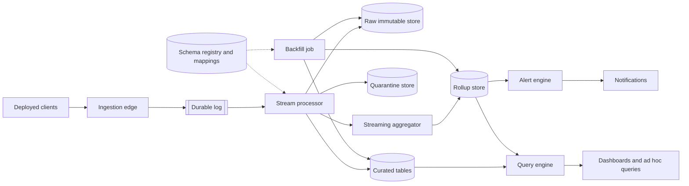

One point worth confirming before designing: whether an old client can eventually be forced to stop sending a deprecated variant (a kill-switch) or must be supported indefinitely for as long as it stays installed. This design assumes the harder case — no forced upgrades — so every recognized variant is supported for as long as it reports traffic, and "deprecating" a mapping rule only ever means marking it inactive for new work, never deleting it while its volume is nonzero.

### Requirements and scale

**Event rate.** $24\times10^6$ clients at 180 events/client/day give $24\times10^6 \times 180 = 4.32\times10^9$ events/day platform-wide, $4.32\times10^9 / 86{,}400 = 50{,}000$ events/sec on average. The 4x peak-to-average ratio puts the design point at $50{,}000 \times 4 = 200{,}000$ events/sec.

**Ingest bandwidth.** At 500 bytes/event, peak ingest is $200{,}000 \times 500\text{ B} = 100\times10^6$ B/s $= 100$ MB/s ($\approx 800$ Mbps) — modest for an edge tier of ordinary servers behind a load balancer, so ingestion is not the bottleneck; the durable log and the stream-processing tier that drains it are sized next.

**Stream-processing pool.** Validating an event, looking up its mapping and schema, checking the dedup index, and enriching it is CPU-bound per-event work, not a call that blocks on a slow remote endpoint, so it is sized by throughput per core rather than by Little's law: budgeting $5{,}000$ events/sec/core, peak load needs $\lceil 200{,}000 / 5{,}000 \rceil = 40$ cores; a 50% margin for GC pauses, partition rebalances, and an occasional slow mapping-table reload rounds that up to $\lceil 40 \times 1.5 \rceil = 60$ cores.

**Durable log partitioning.** Bandwidth alone needs few partitions: at a conservative 4 MB/s/partition budget, $\lceil 100 / 4 \rceil = 25$ partitions cover peak bytes. But partition count also caps how many workers can read the log in parallel — a partition is read by at most one worker in a consumer group at a time — and 60 cores need at least 60 partitions for full parallelism; rounding up to the next power of two gives **64 partitions**, leaving $64 \times 4 = 256$ MB/s of headroom, 2.56x peak. The log is partitioned by a hash of `client_id`, not of `telemetry_name`: millions of distinct clients spread load evenly and no single busy metric can crowd a partition, at the cost of one client's events for different metrics sharing a partition — harmless, since nothing downstream needs one metric's events on a dedicated partition of their own (deep dive (a)).

**Dedup index.** A client may be offline up to a day before replaying its local buffer, so the dedup window is 24 hours: an index entry (a 16-byte hash of `event_id` plus an 8-byte `receive_time` for expiry) per event gives $4.32\times10^9 \times 24\text{ B} \approx 103.7$ GB of steady-state index, sharded like the log so a retried event's lookup lands on the shard that saw the original.

**Storage.** The uncompressed size of one day's events is $4.32\times10^9 \times 500\text{ B} = 2.16$ TB/day. Three tiers keep it at different compression ratios and retentions:

- Tier: Durable log · Compression: 3x (row-oriented) · TB/day: 0.72 TB · Retention: 3 days · Total: 2.16 TB
- Tier: Raw immutable store · Compression: 4x · TB/day: 0.54 TB · Retention: 30 days · Total: 16.2 TB
- Tier: Curated tables · Compression: 8x (columnar, dictionary-encoded) · TB/day: 0.27 TB · Retention: 400 days · Total: 108 TB

The rolled-up aggregates that alerting reads are far smaller: capping each of the $4{,}000$ registered canonical names at 50 actively-reporting dimension combinations per minute (deep dive (b)) gives $4{,}000 \times 50 = 200{,}000$ rolled-up rows/minute; at roughly 100 bytes/row that is 20 MB/min, 28.8 GB/day, 11.52 TB over the same 400-day retention as curated tables. Raw, curated, and rolled-up storage together total about $16.2 + 108 + 11.52 \approx 135.7$ TB; the log's 2.16 TB is transient working storage, not counted with the other three.

**Alert-evaluation cost.** Re-evaluating $2{,}000$ active rules every 30 s is $2{,}000 / 30 \approx 66.7$ evaluations/sec — cheap, because each reads one row of the rolled-up store, not the event stream. Reading raw or curated data directly instead would mean every evaluation re-aggregates its own window from scratch: at peak, a 30 s window holds $200{,}000 \times 30 = 6{,}000{,}000$ events, times $2{,}000$ rules — the rollup tier exists precisely so alerting never pays that cost.

### Data model and API

**TelemetryEvent** (curated) — `event_id`, `client_id`, `client_version`, `schema_version`, `raw_telemetry_name` (exactly as sent), `canonical_telemetry_name`, `mapping_rule_id` (null when the client already sent the canonical name), `event_time`, `receive_time`, `dimensions` (only the fields the schema at `schema_version` declares), `measures` (values already converted to the canonical unit), `extra_fields` (any payload field the registered schema does not declare, kept rather than dropped). Raw storage holds the same shape *before* mapping and unit conversion — `raw_telemetry_name` only, no `canonical_telemetry_name` or `mapping_rule_id` — so it never has to change when a mapping rule changes.

**EventSchema** (registry) — `canonical_name`, `schema_version`, `fields` (a list of `{name, type, unit, classification, required}`), `compatibility` (`backward | breaking`), `owner_team`, `status` (`active | deprecated`), `created_at`; one row per version a canonical name has ever had.

**NameMapping** — `mapping_id`, `raw_name`, `canonical_name`, `field_transforms` (a list of `{raw_field, canonical_field, value_transform}`, empty when no field needs renaming or converting), `status` (`active | deprecated`), `added_by`, `added_at`, `note`; unique on `raw_name`.

**AlertRule** — `rule_id`, `canonical_name`, `filter`, `aggregation` (`count | sum | avg | p95`), `measure`, `window_seconds`, `threshold`, `comparison`, `notify_target`, `owner_team`, `status`.

**RollupRow** — `canonical_name`, `dimension_bucket` (or the reserved `"__other__"` past the cardinality cap of deep dive (b)), `window_start`, `window_grain` (`1m`), `count`, `sum`, `updated_at` (so a re-aggregation can be told apart from the live streaming path).

Core API:

- `POST /v1/ingest` — `{client_id, client_version, schema_version, events: [{event_id, telemetry_name, event_time, dimensions, measures}, ...]}`, authenticated by a per-client credential. Checks envelope shape and auth only; an unrecognized `telemetry_name` is still accepted (deep dive (c)). Returns `202 {accepted: n}`.
- `POST /v1/schemas/{canonical_name}/versions` — `{fields, compatibility}` → `{schema_version}`; `409` if incompatible with the current version under the declared `compatibility` rule (deep dive (c)).
- `POST /v1/mappings` — `{raw_name, canonical_name, field_transforms?, note}` → `{mapping_id, status: "active"}`, and schedules the bounded backfill of deep dive (c). `PATCH /v1/mappings/{mapping_id}` — `{status?, field_transforms?}` edits or deprecates a rule; deprecating stops new events under that `raw_name` from folding in (they quarantine again) without touching what it already mapped.
- `POST /v1/query` — `{canonical_name, filters, group_by, aggregation, time_range}` → rows, run against curated or rolled-up tables by requested grain; every column is checked against the caller's access policy before the query plans (deep dive (d)).
- `POST /v1/alerts` — `{canonical_name, filter, aggregation, measure, window_seconds, threshold, comparison, notify_target}` → `{rule_id, status: "active"}`.
- `GET /v1/mappings/coverage?since=` — `{by_raw_name: [{raw_name, canonical_name_or_null, event_count}, ...], mapped_fraction}` — which unmapped names need a new rule, and which deprecated variants' volume has reached zero (deep dive (c)).

### Architecture



A client's local buffer flushes a batch to `POST /v1/ingest`, which checks the client credential, validates the envelope shape, stamps `receive_time`, and appends each event to the durable log, partitioned by a hash of `client_id`. A stream-processing worker reads the log and, per event: checks the dedup index for `event_id` and drops a repeat; looks up `raw_telemetry_name` in `NameMapping` — a hit resolves `canonical_telemetry_name` and applies any `field_transforms`, a miss leaves it unmapped; validates the now-canonical (or still-raw) payload against the `EventSchema` at the declared `schema_version`, moving any field the schema does not recognize into `extra_fields` rather than dropping it. The worker always writes a copy to raw storage, partitioned by `receive_time`'s date, whether or not mapping succeeded — raw storage is the audit trail and the input to every future backfill. A mapped event also becomes a `TelemetryEvent` row in curated tables, partitioned by `event_time`'s date and by `canonical_telemetry_name`, and updates the streaming aggregator's in-flight window, subject to the watermark rule of deep dive (a); an unmapped event instead goes to the quarantine store, keyed by `raw_telemetry_name`, so its volume stays visible and nothing is lost. Once a window closes, the aggregator writes its `RollupRow`, which the alert engine's next 30 s pass reads for every `AlertRule` registered against that name, notifying `notify_target` on a threshold breach. A dashboard or ad hoc query reaches the query engine through `POST /v1/query`, which plans against curated or rolled-up tables by requested grain and strips or aggregates away any column the caller's access policy does not allow. Separately, when a reviewer adds or edits a `NameMapping` rule through `POST /v1/mappings`, the backfill job reads exactly the raw store's records for that `raw_name` and re-derives the affected curated rows and rollup windows, leaving every other `raw_name`'s data untouched.

### Deep dives

**(a) Ingestion, log partitioning, and stream processing.** The ingestion edge is a stateless tier: it checks the client credential, checks that the batch parses and that every event carries the required envelope fields (`event_id`, `telemetry_name`, `event_time`), stamps `receive_time`, and appends to the log. It rejects only a batch that fails those structural checks — bad auth, an unparseable body, a missing required field — with a `4xx` naming the offending event's index in the batch. An event whose `telemetry_name` the platform has never seen is not the client's fault and is not rejected: it is accepted and handled downstream, in deep dive (c).

*Log partitioning.* Two candidate partition keys:

- *Hash of `telemetry_name`* (its raw, as-sent form, since that is all the log sees): groups one metric's events onto one partition, which looks convenient for a consumer that wants to replay just that metric. Rejected: the same logical metric lands on as many partitions as it has naming variants, undoing the grouping, and a handful of very high-volume metrics concentrate load on their own few partitions while others sit idle — exactly the skew the requirements estimate's choice avoids.
- *Hash of `client_id`* (chosen): millions of distinct clients spread load evenly regardless of which metrics are popular, and the assignment never changes when a mapping rule does. Cost: no partition holds one metric's events together, so a consumer that wants only one metric's history — the backfill job, for instance — reads raw storage instead of the log; the log itself is never a query target, only a short-lived buffer ahead of storage.

*Deduplication.* Log delivery is at-least-once: a worker that crashes after reading a message but before committing its consumer offset sees it again on restart, on top of whatever retries the client itself made. Both are the same problem — the same `event_id` reaching a worker more than once — and one mechanism covers both: before writing anywhere, a worker performs a conditional insert of `event_id` into the dedup index (insert-if-absent, sharded like the log so the check stays local); a conflicting insert means this `event_id` was already processed, and the worker discards the message. The insert must happen *before* the writes it guards, not after — a worker that writes to storage first and only inserts into the dedup index afterward can crash in between, leaving nothing to stop the redelivered message landing twice.

*Late and out-of-order events.* The stream processor tracks a watermark — the largest `event_time` seen so far, minus 10 minutes of allowed lateness — separately for each in-flight rollup window. An event ahead of the watermark updates its window's aggregate directly. One that arrives after its window's watermark has passed is still written to raw and curated storage, merged into the correct historical partition by its true `event_time` (deep dive (b) covers how curated storage does this without rewriting whole files), but it does not reopen the closed rollup window — it only increments a `late_event_count` counter. Once that count crosses a small threshold, or on a fixed daily schedule, whichever comes first, a re-aggregation job recomputes the window from curated storage and overwrites the stored `RollupRow`, keyed by `(canonical_name, dimension_bucket, window_start)` so the overwrite is idempotent: running it twice leaves the same value rather than double-counting. This trades a small, visible amount of under-counting in live alerts for never holding a window open against the last possible straggler. An `event_time` more than 7 days from `receive_time` in either direction — a badly wrong clock, not an ordinary delay — is clamped out of watermark tracking and rollups entirely, though still stored under its real `event_time` for audit, so one broken clock cannot force an old window back open or inject a spike into live alerting.

**(b) Raw-versus-curated storage, the query engine, and alerting.** *Partitioning.* Raw storage is partitioned by `receive_time`'s date: `receive_time` is assigned once, at ingestion, and never revised, so a partition is genuinely append-only. Curated tables are instead partitioned by `event_time`'s date and by `canonical_telemetry_name`, because that is what a query filters on ("last Tuesday's `sync_completed` events"). Partitioning curated storage by `receive_time` instead was rejected: a late event for day $D$ can be received any day after $D$, so a query for day $D$ would have no bound on which `receive_time` partitions to scan, defeating partition pruning for exactly the data most likely to need it. The cost of partitioning by `event_time` is that a late event has to merge into a logical partition that may already have files written for it, so curated tables use a table format whose logical partitions are a mutable list of immutable files (a manifest, not the files themselves): a late write adds a new small file to day $D$'s manifest rather than rewriting day $D$'s existing files.

*Compaction.* Each stream-processing flush (every few seconds) adds one small file per partition it touched, so a continuously active day ends up with thousands of small files — expensive to open one by one and too small to compress well as columns. A compaction job runs the day after a partition's date, once most of its data has landed (the watermark and daily late-data re-aggregation of deep dive (a) have both had a chance to run), merging its small files into a handful of large, well-compressed ones; a partition a later backfill touches (deep dive (c)) is compacted again the next day rather than left fragmented.

*High-cardinality dimensions.* A dimension like `client_id`, or a free-text field that happens to embed one, has millions of distinct values; pre-aggregating a rollup on every combination would make the rollup store as large as curated storage and defeat the point of it. The rollup path instead caps each canonical name at its top 50 dimension combinations by volume within the window — the cap the requirements estimate already assumes — routing everything past that into a shared `"__other__"` bucket. The cap applies only to the always-on rollup path: curated and raw storage keep every dimension at full fidelity, so an ad hoc query can still group by `client_id` over a bounded date range, paying query cost proportional to the rows it scans rather than an unbounded cost the rollup path would otherwise pay continuously on data nobody has asked for yet. An alert rule that legitimately needs to fire per value of an otherwise-capped dimension registers its own narrowly-scoped `RollupRow` keyed to just that `(canonical_name, dimension)` pair, paying dedicated cost for that one rule instead of uncapping the shared rollup for everyone.

*Query engine.* A `POST /v1/query` request plans against curated tables when it needs a full-fidelity dimension, an aggregation the rollup does not precompute, or a date range past the rollup's retention; it plans against the rollup store when the requested grouping is a subset of what the rollup already tracks, which covers most dashboard panels and is orders of magnitude cheaper. Both paths prune first by `canonical_telemetry_name` and by date before scanning a row.

*Alerting.* The alert engine's 30 s pass groups active `AlertRule`s by `canonical_name` so one rollup read serves every rule that watches it, then re-evaluates each rule's `aggregation` over its own `window_seconds` and `filter`. A rule keeps a small `ok | firing` state and notifies `notify_target` only on the transition into `firing`, with a slower repeat (every 30 minutes) while it stays there — otherwise a threshold sitting just over the line would page the same person every 30 s. Because evaluation only reads the rollup store, a rule inherits deep dive (a)'s late-data trade-off: a breach caused by events still waiting out their allowed lateness stays invisible until they land or the daily re-aggregation runs, an accepted, bounded delay rather than a correctness bug.

**(c) Schema registry, compatibility, and the naming-variant follow-up.** *Registry and compatibility.* Each canonical name accumulates one `EventSchema` row per `schema_version` it has ever had; a version, once registered, is never edited or removed, so an old client's payload is checked against the exact version it declares, never against whatever is newest. `POST /v1/schemas/{canonical_name}/versions` accepts a new version under `compatibility: backward` only if every change is additive and lossless against the previous shape (a new optional field with a default, a numeric type widened, a new enum value added); anything else registers as `compatibility: breaking`, which starts a new version but leaves every earlier one resolvable exactly as before. A canonical field name is never reused for two different units or types across versions — a genuinely different measurement gets a new field name (`duration_seconds` alongside, not instead of, a retired `duration_ms`) — so a curated column means one fixed thing no matter which `schema_version` produced the row; the mapping mechanism below moves an old client's value out of its old field and into the new one.

*Where mapping happens.* `NameMapping` is looked up and applied at stream-processing time, before a curated row or rollup update is written. The alternative, resolving `raw_name` at query time instead (curated tables keep the raw name as sent; a view joins against `NameMapping` on every read), was rejected as the primary mechanism: a query-time join keeps every consumer — including the streaming aggregator alerting depends on — responsible for knowing about the mapping table, and a `RollupRow` the streaming path already materialized cannot be fixed by a join that runs later, so alerting would still see a fragmented metric regardless. Processing-time mapping avoids both: curated tables and rollups only ever contain canonical names, so every downstream consumer is simple by construction. Its cost is that changing a rule does not retroactively fix data already written under the old decision — exactly what makes the backfill below necessary, and exactly why every mapped row also keeps `raw_telemetry_name` and `mapping_rule_id`, so the decision stays visible and reversible rather than thrown away once applied. To keep the hot path off a per-event network call, each worker holds `NameMapping` and `EventSchema` in a cache refreshed every 30 s; a rule takes effect for new events within that window, not instantly, and anything arriving in the gap is quarantined and swept up by the same backfill that handles a rule added after the fact — correctness depends on the backfill closing the gap, not on an instant refresh.

*Unknown events.* An event whose `raw_telemetry_name` matches no `NameMapping` row and no `EventSchema.canonical_name` is not dropped or rejected — rejecting it would treat an old client, doing nothing wrong by its own lights, as if it sent malformed data, and dropping it would lose telemetry silently. It goes to the quarantine store, keyed by `raw_telemetry_name` and date, with its full payload, and stays there until a rule maps it.

*Coverage, deprecation, and backfill.* `GET /v1/mappings/coverage` reports, per `raw_name`, how many events it accounted for and whether it resolves to a canonical name; `mapped_fraction` is that count over resolved names divided by the total. Rising unmapped volume for a `raw_name` tells the owning team a new variant needs a rule; a `deprecated` mapping's volume approaching zero tells them it is safe to stop watching it — though, per the assumption at the top of this solution, not to delete the rule while any volume remains. `PATCH /v1/mappings/{mapping_id}` deprecates a rule (new events under that `raw_name` quarantine again, without touching any row it already produced) or edits `field_transforms` (correcting a wrong unit conversion, say), which leaves the rule `active` and puts every row it previously affected back in scope for reprocessing exactly like a newly added rule. Either change enqueues a backfill scoped to exactly that `raw_name`: it scans the raw store's `raw_telemetry_name = <that name>` records — through a per-`raw_name` index, never a full scan — re-derives each one's curated row under the new rule (or returns it to quarantine, if deprecated), and recomputes exactly the rollup windows those rows touch, overwriting each `RollupRow` in place — idempotent, per deep dive (a). Reprocessing is therefore bounded by one `raw_name`'s history, not by curated storage's size, which is what keeps a mapping change practical at this scale; a gap older than the 30-day raw retention cannot be backfilled at all, since its only source no longer holds it, so a high-value variant is worth mapping before its data ages out.

*Why not fuzzy matching or clustering.* Matching `raw_name` to `canonical_name` by string similarity or an unsupervised clustering pass was considered and rejected, for a reason sharper than "it can be wrong": the two ways it can be wrong are not symmetric. Under-mapping — a variant left unmapped — is visible: it shows up as unmapped volume in the coverage report. Over-mapping — folding two genuinely different metrics together because their names look similar — is invisible: nothing distinguishes a canonical row from a correct mapping from one produced by a wrong one, so a bad fuzzy match silently corrupts a metric's history, and by the time the numbers look off the mistake may already be backfilled into weeks of curated data. A similarity threshold is also unstable over time — retraining a model, or just observing more names later, can shift which names it groups, so the same history could be mapped differently on two different runs, breaking the audit trail this design otherwise guarantees. `NameMapping` rules are therefore exact string matches on `raw_name`, added deliberately by a person — typically the owning team, reviewing the coverage report — rather than inferred. Deterministic normalization (lower-casing, collapsing `-`/`_`/case differences) only pre-fills a *suggested* rule for a person to confirm, never applies one outright, since even a purely syntactic suggestion can still be wrong across a genuine unit or semantic difference, as the `duration_ms` example shows.

**(d) Access control, PII, and retention.** Every field in an `EventSchema` carries a `classification`: `public` (counts, `platform`, `client_version`), `internal` (business-sensitive but not personal, visible to the owning team and the wider data organization), `restricted` (could identify or be attributed to one person indirectly, and is not always identifying when it does — `client_id`, a free-text `error_message` that occasionally embeds a username or an email address, the way the requirements above describe), or `pii` (a field that is *only* ever an identifier, so withholding it costs nothing else — a dedicated email-address column, a raw IP). A role's access is the intersection of two checks: which canonical-name namespaces it may query at all (by owning team — a support engineer for one product should not browse another's internal metrics) and which classifications it may see within an allowed namespace. Enforcing only the first — a table-level grant per canonical name — was rejected: most of a `sync_completed` row (`platform`, `duration_seconds`, `client_version`) is unremarkable, and gating the whole row behind its single most sensitive field would deny support engineers the ordinary fields they need every day just because the same event also carries a `restricted` one.

`restricted` fields are never returned at row level without an approved, logged purpose (a ticket reference recorded with the query); every row-level query touching one is written to an audit log — who, when, which columns, how many rows — whether or not access was granted. They may still be used in a `WHERE` filter or a `GROUP BY` key for an *aggregate* query without a special grant, but the field's own value is never one of the returned columns, and the floor that makes this safe is measured in distinct accounts, not rows: the query engine counts how many distinct `client_id`s contributed to each returned bucket and folds any bucket under 25 distinct accounts into `"__other__"`, so a bucket that a filter or a `GROUP BY` has narrowed to one account — however many events that account produced — is suppressed exactly like one with twenty-four genuinely different accounts in it; grouping by `client_id` itself and returning its value is refused outright, since that would project exactly the identifier row-level access already gates. `pii` fields are not reachable through the general query engine at all, row-level or aggregate; they exist only for a narrow compliance workflow outside this design's scope.

*Retention for sensitive fields.* `restricted` and `pii` values are nulled or hashed out of curated storage 30 days after `event_time`, independent of the table's own 400-day row retention: a scheduled job walks each day's partition once it turns 30 days old and rewrites only the files holding those columns, using the same mutable-manifest table format deep dive (b) uses for late data, so the row's other columns and its place in the 400-day history are untouched. Purging at the row level instead — dropping the whole row after 30 days — was rejected: it would throw away 370 days of otherwise-legitimate history (`duration_seconds`, `platform`, counts) along with the one sensitive value, for every row that ever carried one.

### Follow-ups

- A dimension whose allowed spellings change across client versions (not just a measure's unit) needs a value lookup table in `field_transforms`, not a scalar multiplier — the mechanism generalizes, but each lookup table is its own small piece of data-governance work.
- A canonical name with disproportionate volume could be sampled at ingestion (storing a `sample_rate` per event so aggregates scale back up); nothing here assumes every event is kept forever.
- A dedicated per-rule rollup (deep dive (b)) still needs its own cardinality guard if the dimension it keys on is itself unbounded (a `session_id`) — exempting one rule from the shared cap is not a blanket exemption from the problem the cap solves.
- Reclassifying a field from `internal` to `restricted` takes effect for every query from that point on, but cannot recall a result already handed out under the looser classification — catching that is an access-log review, not a mapping-table concern.

The first block recomputes every number the requirements-and-scale estimate quotes. The second builds a small, deterministic model of the mapping-and-backfill mechanism from deep dive (c) — three event-name variants and one field-level unit variant of a canonical metric, a duplicate delivery, an unmapped name, a late event, and two distinct metrics only superficially similar to it — and checks that mapping, dedup, quarantine, coverage, backfill, and deprecation all behave as designed, including that a naive similarity-based matcher over the same names makes exactly the over-merging mistake deep dive (c) argues against; it then checks the column-classification and aggregate-query privacy floor of deep dive (d).

```python
import math

N_CLIENTS, EVENTS_PER_CLIENT_PER_DAY = 24_000_000, 180
events_per_day = N_CLIENTS * EVENTS_PER_CLIENT_PER_DAY
assert events_per_day == 4_320_000_000
events_per_sec_avg = events_per_day / 86_400
assert events_per_sec_avg == 50_000
PEAK_FACTOR = 4
events_per_sec_peak = events_per_sec_avg * PEAK_FACTOR
assert events_per_sec_peak == 200_000

AVG_EVENT_BYTES = 500
bandwidth_peak_bps = events_per_sec_peak * AVG_EVENT_BYTES
assert bandwidth_peak_bps == 100_000_000
assert round(bandwidth_peak_bps * 8 / 1e6) == 800

PER_CORE_EVENTS_PER_SEC = 5_000
cores_raw = events_per_sec_peak / PER_CORE_EVENTS_PER_SEC
assert cores_raw == 40
cores_provisioned = math.ceil(cores_raw * 1.5)
assert cores_provisioned == 60

PARTITION_BUDGET_MB_S = 4
min_partitions_bw = math.ceil((bandwidth_peak_bps / 1e6) / PARTITION_BUDGET_MB_S)
assert min_partitions_bw == 25


def next_pow2(n):
    p = 1
    while p < n:
        p *= 2
    return p


partitions = next_pow2(max(min_partitions_bw, cores_provisioned))
assert partitions == 64
assert partitions * PARTITION_BUDGET_MB_S == 256
assert round(256 / (bandwidth_peak_bps / 1e6), 2) == 2.56

DEDUP_ENTRY_BYTES = 24
dedup_index_bytes = events_per_day * DEDUP_ENTRY_BYTES
assert round(dedup_index_bytes / 1e9, 1) == 103.7

daily_bytes_uncompressed = events_per_day * AVG_EVENT_BYTES
assert daily_bytes_uncompressed == 2_160_000_000_000
TB = 1e12
assert round(daily_bytes_uncompressed / TB, 2) == 2.16


def tier_totals(compression, retention_days):
    daily = daily_bytes_uncompressed / compression
    return daily / TB, (daily * retention_days) / TB


log_daily_tb, log_total_tb = tier_totals(3, 3)
assert round(log_daily_tb, 2) == 0.72 and round(log_total_tb, 2) == 2.16

raw_daily_tb, raw_total_tb = tier_totals(4, 30)
assert round(raw_daily_tb, 2) == 0.54 and round(raw_total_tb, 1) == 16.2

curated_daily_tb, curated_total_tb = tier_totals(8, 400)
assert round(curated_daily_tb, 2) == 0.27 and round(curated_total_tb) == 108

N_CANONICAL, ACTIVE_SERIES_PER_TYPE_PER_MIN = 4_000, 50
rollup_rows_per_min = N_CANONICAL * ACTIVE_SERIES_PER_TYPE_PER_MIN
assert rollup_rows_per_min == 200_000
ROLLUP_ROW_BYTES = 100
rollup_bytes_per_min = rollup_rows_per_min * ROLLUP_ROW_BYTES
assert rollup_bytes_per_min == 20_000_000
rollup_gb_per_day = rollup_bytes_per_min * 1_440 / 1e9
assert round(rollup_gb_per_day, 1) == 28.8
rollup_total_tb = rollup_gb_per_day * 400 / 1_000
assert round(rollup_total_tb, 2) == 11.52

total_tb = raw_total_tb + curated_total_tb + rollup_total_tb
assert round(total_tb, 1) == 135.7

N_ALERT_RULES, EVAL_INTERVAL_S = 2_000, 30
eval_qps = N_ALERT_RULES / EVAL_INTERVAL_S
assert round(eval_qps, 1) == 66.7
raw_scan_rows_per_eval = events_per_sec_peak * EVAL_INTERVAL_S
assert raw_scan_rows_per_eval == 6_000_000

print("all requirements-and-scale numbers check out")
```

```python
import difflib
from collections import defaultdict


class MappingRule:
    def __init__(self, raw_name, canonical_name, field_transforms=None, active=True):
        self.raw_name, self.canonical_name = raw_name, canonical_name
        self.field_transforms = field_transforms or {}
        self.active = active


class RawEvent:
    def __init__(self, event_id, raw_name, event_time, field, value):
        self.event_id, self.raw_name, self.event_time = event_id, raw_name, event_time
        self.field, self.value = field, value


def process(events, mappings, dedup_seen):
    """One pass of dedup -> mapping -> curated/quarantine. `accepted` is what raw storage keeps."""
    curated, quarantine, accepted = [], [], []
    for e in events:
        if e.event_id in dedup_seen:
            continue
        dedup_seen.add(e.event_id)
        accepted.append(e)
        rule = mappings.get(e.raw_name)
        if rule is None or not rule.active:
            quarantine.append(e)
            continue
        canonical_field, multiplier = rule.field_transforms.get(e.field, (e.field, 1.0))
        curated.append(dict(canonical_name=rule.canonical_name, canonical_field=canonical_field,
                             value=e.value * multiplier, event_time=e.event_time,
                             raw_name=e.raw_name, event_id=e.event_id))
    return curated, quarantine, accepted


def aggregate(curated_rows):
    agg = defaultdict(lambda: [0, 0.0])
    for r in curated_rows:
        key = (r["canonical_name"], r["canonical_field"], r["event_time"])
        agg[key][0] += 1
        agg[key][1] += r["value"]
    return agg


def coverage(events, mappings):
    total, mapped = defaultdict(int), defaultdict(int)
    for e in events:
        total[e.raw_name] += 1
        rule = mappings.get(e.raw_name)
        if rule and rule.active:
            mapped[e.raw_name] += 1
    return sum(mapped.values()) / sum(total.values()), dict(total), dict(mapped)


def backfill(raw_name, raw_store, mappings):
    scoped = [e for e in raw_store if e.raw_name == raw_name]   # a per-raw_name index, never a full scan
    return process(scoped, mappings, dedup_seen=set())


# `sync_completed` has three event-name variants and one field-level (unit) variant; `evt_sync_done` is a
# fourth event-name variant not yet mapped; `sync_started` and `sync_completed_v2` are distinct metrics
# that happen to look similar to `sync_completed`, and must never be folded into it.
mappings = {
    "sync_completed": MappingRule("sync_completed", "sync_completed",
                                   {"duration_ms": ("duration_seconds", 0.001)}),
    "SyncCompleted": MappingRule("SyncCompleted", "sync_completed"),
    "sync-completed": MappingRule("sync-completed", "sync_completed"),
    "sync_started": MappingRule("sync_started", "sync_started"),
    "sync_completed_v2": MappingRule("sync_completed_v2", "sync_completed_v2"),
}

main_batch = [
    RawEvent("e1", "sync_completed", 1, "duration_seconds", 10.0),
    RawEvent("e2", "sync_completed", 1, "duration_seconds", 20.0),
    RawEvent("e3", "sync_completed", 1, "duration_ms", 5_000.0),          # -> 5.0 s
    RawEvent("e4", "SyncCompleted", 1, "duration_seconds", 15.0),
    RawEvent("e5", "sync-completed", 1, "duration_seconds", 12.0),
    RawEvent("e2", "sync_completed", 1, "duration_seconds", 20.0),        # retried send of e2
    RawEvent("e6", "evt_sync_done", 1, "duration_seconds", 8.0),
    RawEvent("e7", "evt_sync_done", 1, "duration_seconds", 9.0),
    RawEvent("e8", "evt_sync_done", 2, "duration_seconds", 6.0),
    RawEvent("e9", "sync_started", 1, "v", 100.0),
    RawEvent("e10", "sync_completed_v2", 1, "v", 200.0),
]

dedup_seen = set()
curated, quarantine, accepted = process(main_batch, mappings, dedup_seen)
raw_store = list(accepted)   # raw storage keeps exactly what survived dedup, whether mapped or not

assert len(accepted) == 10 and len(curated) + len(quarantine) == 10          # the retried e2 is dropped once
assert sum(1 for e in accepted if e.event_id == "e2") == 1

agg = aggregate(curated)
assert agg[("sync_completed", "duration_seconds", 1)] == [5, 62.0]           # 10+20+5(=5000ms)+15+12
assert agg[("sync_started", "v", 1)] == [1, 100.0]                           # a distinct metric, not merged
assert agg[("sync_completed_v2", "v", 1)] == [1, 200.0]                      # a distinct metric, not merged
assert len(quarantine) == 3 and {e.raw_name for e in quarantine} == {"evt_sync_done"}

# a naive similarity-based matcher would make exactly the over-merging mistake exact-match mapping avoids.
# `sync_completed_v2` is a later, genuinely distinct metric; score it against what was already established.
established_canonical_names = {"sync_completed", "sync_started"}


def fuzzy_canonical(raw_name, threshold=0.85):
    norm = raw_name.lower().replace("-", "_")
    best, best_score = None, 0.0
    for c in established_canonical_names:
        score = difflib.SequenceMatcher(None, norm, c).ratio()
        if score > best_score:
            best, best_score = c, score
    return best if best_score >= threshold else None


assert fuzzy_canonical("SyncCompleted") == "sync_completed"                  # a real variant: fuzzy gets lucky
assert fuzzy_canonical("sync_completed_v2") == "sync_completed"              # WRONG: a distinct new metric, folded in
assert mappings["sync_completed_v2"].canonical_name == "sync_completed_v2"   # exact match + registration keeps it apart

# a rule that only fixes a field, not the event name, is a `NameMapping` whose raw_name == canonical_name
assert mappings["sync_completed"].raw_name == mappings["sync_completed"].canonical_name
assert mappings["sync_completed"].field_transforms["duration_ms"] == ("duration_seconds", 0.001)

# late event: keyed by its true event_time, excluded from the already-closed window, corrected idempotently
live_rollup = {k: list(v) for k, v in agg.items()}
key = ("sync_completed", "duration_seconds", 1)
late_curated, late_quarantine, _ = process(
    [RawEvent("e11", "sync_completed", 1, "duration_seconds", 100.0)], mappings, dedup_seen)
assert late_curated[0]["event_time"] == 1 and not late_quarantine
assert live_rollup[key] == [5, 62.0]                                          # unchanged until re-aggregated


def reaggregate(all_curated_rows, key):
    matching = [r for r in all_curated_rows
                if (r["canonical_name"], r["canonical_field"], r["event_time"]) == key]
    return [len(matching), sum(r["value"] for r in matching)]


corrected = reaggregate(curated + late_curated, key)
assert corrected == [6, 162.0]
live_rollup[key] = corrected
assert reaggregate(curated + late_curated, key) == corrected                  # idempotent: re-running is a no-op

# coverage before a rule exists for `evt_sync_done`: visible as unmapped volume, not silently lost
before_mappings = {k: v for k, v in mappings.items() if k != "evt_sync_done"}
frac_before, total_by_name, mapped_by_name = coverage(accepted, before_mappings)
assert total_by_name == {"sync_completed": 3, "SyncCompleted": 1, "sync-completed": 1,
                          "evt_sync_done": 3, "sync_started": 1, "sync_completed_v2": 1}
assert mapped_by_name.get("evt_sync_done", 0) == 0 and round(frac_before, 2) == 0.7

# adding the rule and backfilling: scoped to exactly this raw_name, corrects history, is idempotent
mappings["evt_sync_done"] = MappingRule("evt_sync_done", "sync_completed")
bf_curated, bf_quarantine, bf_accepted = backfill("evt_sync_done", raw_store, mappings)
assert bf_quarantine == [] and len(bf_accepted) == 3
assert sorted(r["value"] for r in bf_curated) == [6.0, 8.0, 9.0]
assert {r["canonical_name"] for r in bf_curated} == {"sync_completed"}
assert backfill("evt_sync_done", raw_store, mappings)[0] == bf_curated        # re-running reproduces the same rows

frac_after, _, mapped_after = coverage(accepted, mappings)
assert mapped_after["evt_sync_done"] == 3 and frac_after == 1.0

# deprecating a rule quarantines new traffic again without touching what it already produced
mappings["sync-completed"] = MappingRule("sync-completed", "sync_completed", active=False)
dep_curated, dep_quarantine, _ = process(
    [RawEvent("e12", "sync-completed", 1, "duration_seconds", 999.0)], mappings, set())
assert dep_quarantine and not dep_curated
assert agg[("sync_completed", "duration_seconds", 1)] == [5, 62.0]            # the earlier aggregate is untouched

print("mapping, dedup, late-data, coverage, and backfill all behave as designed")

# --- access control: column classification and the aggregate-query privacy floor ---
row = {"platform": "linux", "client_id": "c-42", "duration_seconds": 5.0}
classification = {"platform": "public", "client_id": "restricted", "duration_seconds": "public"}


def project(row, classification, allowed):
    return {f: v for f, v in row.items() if classification.get(f, "public") in allowed}


support_view = project(row, classification, {"public", "internal"})
assert "client_id" not in support_view and support_view["platform"] == "linux"
compliance_view = project(row, classification, {"public", "internal", "restricted"})
assert compliance_view["client_id"] == "c-42"


def aggregate_with_privacy_floor(rows, bucket_fn, id_fn, floor=25):
    """Buckets rows by a non-identifying dimension (bucket_fn) and reports a bucket's row count only
    once at least `floor` distinct ids (id_fn) contributed to it; a thinner bucket -- however many rows
    it holds -- folds into "__other__", so narrowing a bucket down to one account never earns it a
    visible row."""
    buckets, counts = defaultdict(set), defaultdict(int)
    for r in rows:
        b = bucket_fn(r)
        buckets[b].add(id_fn(r))
        counts[b] += 1
    out, suppressed = {}, 0
    for b in sorted(buckets):                      # a fixed order, independent of hash seed
        if len(buckets[b]) >= floor:
            out[b] = counts[b]
        else:
            suppressed += counts[b]
    if suppressed:
        out["__other__"] = suppressed
    return out


# GROUP BY platform over 30 distinct accounts, 2 events each: enough distinct accounts clears the floor
many_accounts = [{"platform": "linux", "client_id": f"c{i}"} for i in range(30) for _ in range(2)]
assert aggregate_with_privacy_floor(many_accounts, lambda r: r["platform"], lambda r: r["client_id"]) \
    == {"linux": 60}                                # 60 rows shown, gated on 30 distinct accounts, not row count

# WHERE client_id = 'c1', then GROUP BY platform: however many events, it is still a single account
one_account = [{"platform": "linux", "client_id": "c1"}] * 200
assert aggregate_with_privacy_floor(one_account, lambda r: r["platform"], lambda r: r["client_id"]) \
    == {"__other__": 200}                           # 200 rows from one account never get a visible bucket

# a mixed case: 27 distinct accounts on "linux" clear the floor, 3 distinct accounts on "windows" do not
mixed_accounts = ([{"platform": "linux", "client_id": f"c{i}"} for i in range(27)]
                   + [{"platform": "windows", "client_id": f"w{i}"} for i in range(3)])
assert aggregate_with_privacy_floor(mixed_accounts, lambda r: r["platform"], lambda r: r["client_id"]) \
    == {"linux": 27, "__other__": 3}

print("all checks passed")
```
